*[Markdown: Help](https://github.com/adam-p/markdown-here/wiki/Markdown-Cheatsheet)*

* [ВСЯ грамматика для общения за 77 минут!](https://www.youtube.com/watch?v=KeKpqmncB3k) **(** [Вся английская грамматика за 90 минут!](https://www.youtube.com/watch?v=rtmaDeR9Iz8) > [Скачать](https://www.ssyoutube.com/watch?v=rtmaDeR9Iz8) **)**
* [12 Английских Времён](https://www.youtube.com/watch?v=SZeG70-XYCA) **(** [9 формул для общения](https://www.youtube.com/watch?v=eN1we9_RI_8) **|** [Все времена в английском](https://www.youtube.com/watch?v=l26n_plMwYw) **|** [ВСЕ МЕСТОИМЕНИЯ АНГЛИЙСКОГО ЯЗЫКА](https://www.youtube.com/watch?v=qkHiL7IH-Rs) **)**
* [Английская грамматика за 20 минут](https://www.youtube.com/watch?v=oWCL0rm_VcA) **(** [Англійська граматика в таблицях](https://uchebe.net/referati/topiki-po-anglijskomu-yazyku/kniga-anglijska-gramatika-v-tablicyah) **)**
* [Полиглот английский за 16 часов.](https://www.youtube.com/watch?v=y9fFDpSqKdQ)
* [Coach Shane - Q&A](https://www.youtube.com/watch?v=AGiLUyWvLPI&list=PLKYJHW3dXOM7pXJOZVMb2rr15qg7-cL5D) **(** [American Pronunciation](https://www.youtube.com/watch?v=TgGvXPHGs1I) **|** [American English Pronunciation](https://www.youtube.com/watch?v=MqcCCFptaJk) **)**
* [BBC World Service](http://bbcworldservice.radio.net) **(** [BBC World Service](http://www.bbc.co.uk/radio/player/bbc_world_service) **)**
* ( `Книга` [STUDENT'S BOOK](CE%20ELEM%203RD%20SB.pdf) )
* `Книга` [EGE 2013 Dolgopolskaya var 15](EGE%202013%20Dolgopolskaya%20var%2015.pdf) > [Скачать](http://5splusom-school.ru/uploads/Angliisky%20iazik/EGE/KIMy%202012%202014/EGE%202013%20Dolgopolskaya%20var%2015.pdf)
* `Книга` [Harry Potter and the Sorcerer's Stone](Harry%20Potter%20and%20the%20Sorcerer's%20Stone.pdf) > [Скачать](http://www2.sdfi.edu.cn/netclass/jiaoan/englit/download/Harry%20Potter%20and%20the%20Sorcerer's%20Stone.pdf)
* `Книга` [Gladiator](Gladiator.pdf) > [Скачать](http://fobook.ru/fobook/intermediate/Dewey_Gram_-_Gladiator.pdf)
* `Фильм` [Гарри Поттер и Философский камень на английском с субтитрами](http://lelang.ru/english/series/garri-potter-i-filosofskij-kamen-na-anglijskom-s-subtitrami/) **(**[Гарри Поттер и Философский камень на английском с субтитрами](http://vasabi.tv/video/341-harry-potter-and-the-philosophers-stone/) **)**
* `Фильмы` [Top Gear](https://www.youtube.com/watch?v=nSqzp3kdAm4) **|** [I, Robot](https://fmovies.se/film/i-robot.r34y/024p43) **|** [Troy](https://fmovies.se/film/troy.6v39/w1pzyl) **|** [Gladiator](https://fmovies.se/film/gladiator.xrz3/806xpn) **|** [Alien](https://fmovies.se/film/alien.rl8p/oj17j5) **|** [Terminator](https://fmovies.se/film/the-terminator.9o9m)
* `Другие фильмы` [1.](http://vasabi.tv/video/movie/) **|** [2.](http://vasabi.tv/user/profile/admin/) **|** [3.](http://vasabi.tv/video/91-breaking-bad-sezon-1-epizod-1/) **|** [4.](http://lyricstranslate.com/ru/duck-tales-утиные-истории.html-1)
* `Еще фильмы` [Кинг Конг (2005)](http://baskino.co/films/boeviki/1242-king-kong.html) **|** [Один дома](http://baskino.co/films/komedii/747-odin-doma.html) **|** [Один дома 2](http://baskino.co/films/komedii/749-odin-doma-2.html) **|** [Один дома 3](http://baskino.co/films/boeviki/751-odin-doma-3.html) **|** [Один дома 4](http://baskino.co/films/komedii/753-odin-doma-4.html) **|** [Онг Бак (2003)](http://baskino.co/films/boevie-iskustva/331-ong-bak.html) **|** [Troy](https://fmovies.se/film/troy.6v39/w1pzyl) **|** [I, Robot](https://fmovies.se/film/i-robot.r34y/024p43)
* `Сказки на английском языке` [correctenglish.ru](http://www.correctenglish.ru/reading/fairy-tales/)
* **(** [еще](https://github.com/Home-GWT/TopLinkExample/blob/master/docs/AboutMe.txt#L41) **)**
* **[Online проверка и коррекция произношения](https://speechpad.ru/prononce.php)** **(** skmets@gmail.com **+** jhpot **)**   **[Speech Recognition Tool](https://www.textfromtospeech.com/en/voice-to-text)**    **(** [Английские фразы и выражения](https://ru.speaklanguages.com/английский/фразы/) **|** [75 способов грамотно начать предложение на английском](https://www.adme.ru/zhizn-nauka/75-sposobov-gramotno-nachat-predlozhenie-na-anglijskom-770710) **)**

```
---------------[ ??? ]------------------------[
  WHAT ? ...... что/какой ?
   WHO ? ...... кто ?
 WHERE ? ...... где ?
  WHEN ? ...... когда ?
   WHY ? ...... почем/зачем ?
   HOW ? ...... как ?
```


Притяжательность **(** [Притяжательный падеж в английском языке](http://engblog.ru/possessive-case) **|** [Англійська граматика](https://www.google.com.ua/search?q=підмет+присудок+додаток+означення+обставина&tbm=isch&tbo=u&source=univ&sa=X&sqi=2&ved=0ahUKEwjk-7XZs-nSAhUJKpoKHWFeDTsQsAQIFw&biw=1467&bih=725#imgrc=egDtbDUDBvalmM:) **)**:

|    `SUBJECT`   |       `OBJECT`      |      `OBJECT`     |
| -------------- | ------------------- | ----------------- |
|     *Кто ?*    |        *Чье ?*      |  *Кому / Кого ?*  |
| -------------- | ------------------- | ----------------- |
| I    `я`       | MY    `мое`         | ME   `мне`        |
|                |                     |                   |
| YOU  `ты / Вы` | YOUR  `твое / Ваше` | YOU  `тебе / Вам` |
| WE   `мы`      | OUR   `наше`        | US   `нам`        |
| THEY `они`     | THEIR `их`          | THEM `им`         |
|                |                     |                   |
| HE   `он`      | HIS   `его`         | HIM  `ему`        |
| SHE  `она`     | HER   `ее`          | HER  `ей`         |
| IT   `оно`     | ITS   `его`         |                   |


Врремя:

|                    | Будущее `BE` | Настоящее `BE` | Прошлое `BE` |
| ------------------ |:------------:|:--------------:|:------------:|
| **I**    `я`       |              | AM             |              |
| ------------------ |              | -------------- |              |
| **HE**   `он`      |              |                | WAS          |
| **SHE**  `она`     |              | IS             |              |
| **IT**   `оно`     | WILL         |                |              |
| ------------------ |              | -------------- | ------------ |
| **YOU**  `ты / Вы` |              |                |              |
| **WE**   `мы`      |              | ARE            | WERE         |
| **THEY** `они`     |              |                |              |


```
                                     12345
                                     |||||
     ----------------------------- --++----- ------------------------------------------------------------------------------------------------------
                                     ++
                                     ++
                                     ++
                                     ++     [2] BY GOING TO                                 | > going to + am/are/is
                                     ++        (будущее:                                    |
                                     ++         действие которое планируется, предсказание) |
                                     ++
                                     ++
                                     ++
                                     ++
                                     +++----
                                     + +
 [1] PRESENT SIMPLE                  + +    [3] PRESENT CONTINUOS           | > am/are/is +ing
    (настоящее:                      + +       (настоящее:                  | > место нахождения (пребывания)
     происходит регулярно/постояно)  + +        происходит в данный момент) |
     -----------------------------   + +++--
     > do +s (ед.число: es|ies)      + +++  [4] PRESENT PERFECT                                                           | > have ('ve) | has
     > слова частоты действия        + +++     (прошедшее причастие: произошло в прошлом но имеет отношение к настоящему) | > что имею (чем владею)
                                     + +++--
                                     +   +
                                     +   +
                                     +   +  [5] PAST SIMPLE                  | > did + d (ed|ied)
                                     +   +     (прошедшее:                   | > was|were
                                     +   +      действие которое уже прошло) |
                                     +   +
                                     +   +
                                     +   +
     ----------------------------- --+---+-- ------------------------------------------------------------------------------------------------------
      Когда рассказывается об        |||||    Когда рассказывается об исторических фактах которые пренадлежат конкретному временному периоду...
      действии, которое одинаково    12345
      может принадлежать каждому
      (и всем) временным
      периодам...


                                  Вопрос        |              Утверждение            |       Отрицание
+------------------+    +-----------------------+-------------------------------------+-----------------------+
|      |           |  Б |      I .......        | I .......................           | I .....               |
|      |           |  у |      HE ......        | HE ......................           | HE ....               |
|      |           |  д |      SHE ..... [BE] ? | SHE ..................... WILL [BE] | SHE ... WILL NOT [BE] |
| WILL | +GOING TO |  у | WILL IT ...... love?  | IT ......................      love | IT ....          love |
|      |           |  щ |      YOU ..... see?   | YOU .....................      see  | YOU ...          see  |
|      |           |  е |      WE ......        | WE ......................           | WE ....               |
|      |           |  е |      THEY ....        | THEY ....................           | THEY ..               |
+------------------+  --+------[окончания]------+-----[окончания|процесс]-------------+------[окончания]------+
|           |      |  Н | [AM] ... I ....       | I ......      | I ..... AM          | I ......              |
|           |      |  а | DO ............ love? | ........ [DO] | ......              | ........              |
| DO        |      |  с |       .. YOU .. see?  | YOU .... love | YOU ..              | YOU .... DON'T love   |
|           |      |  т | [ARE] .. WE ...       | WE ..... see  | WE ... ARE [DO+ING] | WE .....       see    |
|           | +ING |  о |       .. THEY .       | THEY ...      | THEY .     loving   | THEY ...              |
| - - - - - |      |  я | - - - - - - - - - - - | - - - - - - - | ......     seeing   | - - - - - - - - - - - |
|      |    |      |  щ | [IS] ... HE ... love? | HE ... [DO+S] | HE ....             | HE ..... DOESN'T love |
| DOES | +S |      |  е | DOES ... SHE .. see?  | SHE .. loves  | SHE ... IS          | SHE ....         see  |
|      |    |      |  е |      ... IT ...       | IT ... sees   | IT ....             | IT .....              |
+------------------+  --+-----------------------+-------[неправильные глаголы]--------+-----------------------+
|      |           |  П |      ........ I       | I ......      | I ...........       | I ....                |
|      |           |  р |      ....... HE       | HE .....      | HE ..........       | HE ...                |
|      |           |  о | [BE] ...... SHE ?     | SHE .... WAS  | SHE ......... [ED]  | SHE ..        [BEN'T] |
|      |           |  ш | DID ........ IT love? | IT .....      | IT .......... loved | IT ... DIDN'T love    |
| DID  | +ED       |  е |     ........... see?  |          [BE] | ............. saw   | ......        see     |
|      |           |  д |     ....,.. YOU       | YOU ....      | YOU .........       | YOU ..                |
|      |           |  ш |     ....,... WE       | WE ..... WERE | WE ..........       | WE ...                |
|      |           |  е |     ..,... THEY       | THEY ...      | THEY ........       | THEY .                |
|      |           |  е |                       |               |                     |                       |
+------------------+    +-----------------------+-------------------------------------+-----------------------+
```


[I've правила](https://books.google.com.ua/books?id=quroCwAAQBAJ&pg=PA116&lpg=PA116&dq=i've+правила&source=bl&ots=y9z5YawBee&sig=idIKMbsHb6v6Ljn0EDMS6br3PkM&hl=ru&sa=X&ved=0ahUKEwjUw9yEv-TSAhUFBSwKHcHXDAAQ6AEITzAJ#v=onepage&q&f=false) **(** [Present Perfect Continuous - настоящее совершенное длительное время](https://www.native-english.ru/grammar/present-perfect-continuous) **|** [1](http://eng911.ru/rules/grammar/have-has-had-pravila.html) **|** [2](http://eng911.ru/rules/time/present-perfect-i-present-continuous.html) **|** [3](https://www.learnathome.ru/grammar/have-has.html) **)**

  Будущее: I (I/You/We/They//He/She/It) will have ... = I'll have ...
           I (I/You/We/They//He/She/It) will not have ... = I won't have ...

Настоящее: I/You/We/They have ... = I've ...
               He/She/It has ...
           I/You/We/They don't have ... = I haven't got ...
             He/She/It doesn't have ... = He has't got ...
            Do I/You/We/They have ? = Have I got ?
           Does He/She/It have ? = Has He got ?

Прошедшее: I (I/You/We/They//He/She/It) had ...
           I (I/You/We/They//He/She/It) didn't have ...

Глагол `to have`:

|           | Утверждение                                | Отрицание                                      | Вопрос                  |
| --------- | ------------------------------------------ | ---------------------------------------------- | ----------------------- |
| Будущее   | I (I/You/We/They//He/She/It) will have ... | I (I/You/We/They//He/She/It) will not have ... |                         |
|           | I'll have ...                              | I won't have ...                               |                         |
| --------- | ------------------------------------------ | ---------------------------------------------- | ----------------------- |
| Настоящее | I/You/We/They have ...                     | I/You/We/They don't have ...                   | Do I/You/We/They have ? |
|           | He/She/It has ...                          | He/She/It doesn't have ...                     | Does He/She/It have ?   |
|           | I've ...                                   |                                                |                         |
|           | I/You/We/They have got ...                 | I haven't got ...                              | Have I got ?            |
|           | He/She/It has got ...                      | He has't got ...                               | Has He got ?            |
| --------- | ------------------------------------------ | ---------------------------------------------- | ----------------------- |
| Прошедшее | I (I/You/We/They//He/She/It) had ...       | I (I/You/We/They//He/She/It) didn't have ...   |                         |
|           | I (I/You/We/They//He/She/It) have been ... |                                                |                         |

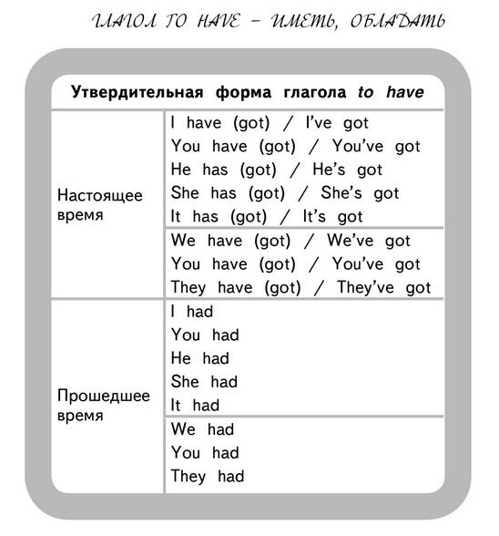
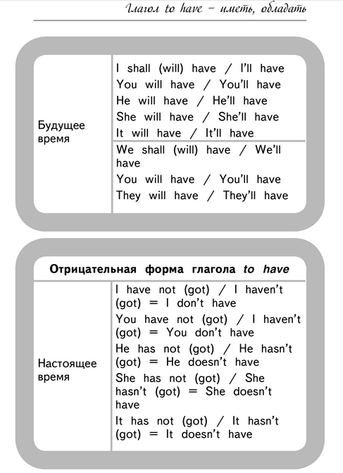
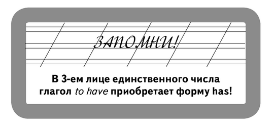
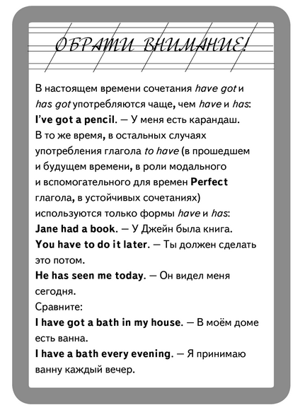


Место:

|              | *Единственное число* | *Множественное число* |
| ------------ | -------------------- | --------------------- |
| ***Рядом***  | THIS                 | THESE                 |
| ***Далеко*** | THAT                 | THOSE                 |


[Английские предлоги места](http://online-teacher.ru/study/english-predlogi-mesta) **|** [Английские предлоги времени](http://english-tutorial.ru/grammar-96/) **|** [Употребление much, many, few, little, a lot of, plenty](http://engblog.ru/much-many-few-little-a-lot-of-plenty-usage) **|** [Some – any, much – many, few – little](https://onlineteachersuk.com/blog/some-any-much-many-few-little-kak-upotreblyat-eti-slova)

```
-----------------------------[ Английские предлоги места ]
0. -=ЕСЛИ ПРИСУТСТВУЕТ СЛОВО ЧТО УКАЗЫВАЕТ НА МЕСТО=-
>  'next to', 'beside', 'by' ... непосредственно рядом, очень близко от чего-либо
>  'under' ..................... расположение ниже/под чего-либо
>  'below' ..................... расположение ниже какого-либо уровня
>  'over' ...................... расположение сверху (на поверхности) чего-либо
>  'above' ..................... расположение над чем-либо (выше)
>  'across' .................... расположение с другой стороны; переход на другую сторону чего-либо
>  'through' ................... прохождение насквозь, движение сквозь что-либо
>  'to' ........................ движение по направлению к кому-либо или к чему-либо
>  'into' ...................... движение, перемещение внутрь чего-либо
>  'towards' ................... движение по направлению к чему-либо или кому-либо, приближение без необходимости достижения цели
>  'onto' ...................... движение, перемещение наверх
>  'from' ...................... движение откуда-либо, от какой-то отправной точки; указание на происхождение

1. -=НАХОДИТСЯ ВРЕМЕННО (НА КОРОТКОЕ ВРЕМЯ) ГДЕ-ТО ВНУТРИ ЧЕГО-ТО=-
>  'at' ........................ at the railway station, at the theatre, at the birthday party

2. -=НАХОДИТСЯ ВРЕМЕННО (НА КОРОТКОЕ ВРЕМЯ) ВОЗЛЕ, ОКОЛО, НА ЧЕМ-ЛИБО СВЕРХУ=-
>  'on' ........................ on the right side, on the sixth floor, on the radio, on TV

3. -=НАХОДИТСЯ ПОСТОЯННО (НА БОЛЕЕ ДЛИТЕЛЬНОЕ ВРЕМЯ) ГДЕ-ТО ВНУТРИ (В РАМКАХ) ЧЕГО-ТО=-
>  'in','in the' ............... in Berlin, in the train, in the letter


-----------------------------[ Английские предлоги времени ]
0. -=ЕСЛИ ПРИСУТСТВУЕТ СЛОВО ЧТО УКАЗЫВАЕТ НА ВРЕМЯ=-
>  предлог не ставится если выражение включает одно из слов: 'next','last','this','that','one','any','each','every','some','all'
   перед названиями дней в разговорной речи часто опускается предлог 'on' а периодичность может обозначаться словами days, nights, mornings, evenings, afternoons.

1. -=ВРЕМЯ ЧТО ВНУТРИ МЕНЕЕ-СУТОК=-
>  'at' ............ используется для обозначения внутрисуточного времени: at 10 o’clock, at 7.45, at midnight, at night, at dinner.
   ставится перед словами выражающими периодичность или сиюминутность: at the weekend, at weekends.
                                                 популярные праздники: at Christmas, at New Year, at Easter.
                                                    отдельные моменты: at the moment, at present, at the same time.

2. -=ДЛЯ ДАТ, ДЛЯ (ДАТ)ПРАЗДНИЧНЫХ ДНЕЙ, ДЛЯ (ДАТ)ДНЕЙ НЕДЕЛИ=-
>  'on' ............ используется для обозначения дней недели: on Monday, on Tuesdays.
                                                                       даты и праздники: on 21 March 1996, on April 1st, on Christmas Day, on my birthday
   если перед временем суток указан день недели то словосочетание идет с предлогом 'on': on Saturday morning, on Sunday evening

3. -=ВРЕМЯ НА БОЛЕЕ ДЛИТЕЛЬНЫЕ-ПЕРИОДЫ И ВРЕМЯ НА ПРОМЕЖУТОК ВРЕМЕНИ=-
>  'in','in the' ... характеризует наиболее продолжительные периоды (месяцы, сезоны, года): in January, in (the) winter, in 1984, in the 1960s, in the 20th century, in the past, in (the) future.
   еще 'in','in the' определяет за какой промежуток выполняется действие: in the morning(s), in the afternoon(s), in the evening(s), in the night. Окончание -s указывает на то что событие повторяется каждый упомянутый период.


-----------------------------[ Исчесляемые и неисчесляемые существительные ]
1. -=ИСЧЕСЛЯЕМЫЕ существительные=-
>  'Many / Few' ............. много / мало (несколько)

2. -=НЕИСЧЕСЛЯЕМЫЕ существительные=-
>  'Much / Little' .......... много / мало (немного)

3. -=ИСЧЕСЛЯЕМЫЕ и НЕИСЧЕСЛЯЕМЫЕ существительные=-
>  'A lot of / Plenty of' ... много / очень много

   -= (+) =-
Small team .................. (только одна конкретная) маленькая команда
Big team .................... (только одна конкретная) большая команда
Some couples ................ (какой-то там один / много каких-нибудь там) чашки - только в утвердительных предложениях
Any couples ................. (какой-то там один / много каких-нибудь там) чашки? - в отрицательных и вопросительных предложениях

-----------------------------[  ]
The best .... самый лучший ( Better ... лучше )
The worst ... самый худший ( Worse .... хуже )
More than ... больше чем ( More ... больше )
Less than ... меньше чем ( Less ... меньше )

-----------------------------[ (some | every | any) ]
Each ......... каждый (когда речь идет о 2-ух и более предметах или вещах)
Every ........ каждый (когда речь идет о 3-ех и более предметах или вещах) || ever, everyone, everybody = каждый из..., anyone; anybody = никто из...;
Ever ......... когда-либо, когда-нибудь
Everything ... всякий
Whenever ..... всякий раз когда
Everyone ..... каждый
Anything ..... ничто
Something .... что-либо одно

-----------------------------[ (same | some) ]
some ............... некоторые
something .......... что-то
someone/somebody ... кто-то
sometimes .......... иногда
same ............... одно и тоже
same thing ......... тоже самое
same one/body ...... тот самый (такое-же тело)
same times ......... одновременно

-----------------------------[ (what | that | than | so) ]
how ............. как? (вопрос, "How much?" сколько...)
as .............. как (подобно этому, как...)
what ............ что? (вопрос, что|какой...)
that ............ что (тот фак, что...)
than ............ чем (сравнительно, менее или более чем...)
then ............ тогда (при условии, тогда...)
so .............. тогда (связка между предложениями для продолжения разговора, значит ну тогда...)


Have you got any sugar in the cupboard? .......................... Вы имеете какой-нибудь сахар в кухонном шкафу?
Does she feel any better today? .................................. Она чуствует себя как-то лучше сегодня?
The government didn't take any steps to prevent the recession. ... Правительство не предприняло никаких шагов для предотвращения рецессии.
```


---
( В английском языке предложение формируется с точностью до наоборот по отношению к русскому языку )
```
В английском языке порядок слов имеет значение (ИНИЦИАТОР ДЕЙСТВИЯ + САМО ДЕЙСТВИЕ + ПРЕДМЕТ ВОЗДЕЙСТВИЯ ~ ДОПОЛНЕНИЕ).
В английском языке при формировании предложения всегда нужно показывать время и место, когда и где происходит действие.
В английском языке НЕможет быть не полных предложений.
В английском языке любое сложное предложение формируется из простых предложений С условным союзом (связкой) между простыми предложениям.
В английском языке нельзя формировать сложные предложения которые интуитивно будут связывать внутри между собой простые предложения по смыслу (как в русском языке).

Любое простое предложение в английском языке должно формироваться: ИНИЦИАТОР ДЕЙСТВИЯ + САМО ДЕЙСТВИЕ + ПРЕДМЕТ ВОЗДЕЙСТВИЯ ~ ДОПОЛНЕНИЕ
1. Полное предложение (стандартные предложения) - это предложение с явным смыслом, в котором присутствуют все состовляющие элементы (инициатор, действие, физический предмет)
   ( Я читаю книгу )
   ( Я иду на работу )
   ( Я посещаю спортзал )
2. НЕполное предложение (НЕстандартные предложения) - это предложение с абстрактным смыслом, в котором могут отсутствовать состовляющие элементы (инициатор, физический предмет...)
   ( Я сильный )
   ( Я здоровый )
3. Условные преддложения (сложные предложения) - такие предложения являются сложными и формируются из 2-х или более простых предложений, которые связываются союзом-условия (...)
   ( Я могу получить хорошую работу когда я буду иметь высокий уровень английского )

Слова заглушки (это слова с абстрактым смыслом, которые НЕуказывают на конкретного иннициатора действия)
- В русском языке таких слов очень много:
  ( Выходит что... | тогда выходит что... )
  ( Получается что... )
  ( Тогда... )
  ( Значит... )
  ( В таком случае... )
  ( ...справляться с... )
  ( ...имел дело с... | ты когда нибудь работал с ...? )  DID YOU WORK WITH COMPUTERS SOMETIME? | HAVE YOU EVER WORKED WITH COMPUTERS?
  ( честно говоря... | если честно то... | я хочу быть честным для вас чтобы сказать... )  I WANT TO BE HONEST TO YOU THAT TO TELL...
  ( рассказывать о себе тяжело... | это есть тяжело чтобы рассказывать о себе... )  IT'S DIFFICULT THAT TELL ABOUT SELF...
  ( я имею дела )  I HAVE BUSINESS
  ( если-бы я хорошо знал английский язык )  THAT I HAVE HIGHT LEVEL ENGLISH LEVEL
  ( что там... )
- В английском языке это:
  предмет ( something/somebody :: что/кто-нибудь )
  место ( there is/are :: где-то там )
  время ( usualy, sometime :: обычно, иногда )

Условные выражения в английском языке:
- В отличие от русского языка, в английском языке всегда на первое место в предложении выносится те слова в которых заложен основной смысл
  ( Я МОГ-БЫ ИМЕТЬ ХОРОШУЮ РАБОТУ если-бы хорошо знал английский язык )
- В английском языке предлоожения с условными словами не формируют. Чтобы сформировать предложение с условием - для этого нужно сформировать сложное предложение и разбить на две части:
  1-часть формирует - основную цель
  2-часть формирует - при каком условии что-то будет происходить
  союз - обе части предложения связываются союзом, которое определяет условие
  ( я могу иметь хорошую работу КОГДА буду иметь высокий уровень английского языка )
- в английский языке будет неправильно формировать предложения с интуитивным смыслом, всегда нужно точно выражать идею, время и место
  ( я могу ПОЛУЧИТЬ хорошую работу когда буду иметь высокий уровень английского языка )
  ( иметь - это может быть любое действие, которое уже совершилось )
  ( получать - это абстрактное действие, которое указывает только на цель )
- В английском языке есть несколько способов связать по смыслу словосочетания
  ( СВОЙСТВА + СУЩЕСТВИТЕЛЬНОЕ - белый стул ... white chair ... a white chair )
  ( ПРИНАДЛЕЖНОСТЬ - стул дочки ... daughter's chair ... my daughter's chair )
  ( ПО СМЫСЛУ - высокий уровень английского ... high level of english ... a high level of english )
  ( I can get A GOOD JOB than I'll A HIGH LEVEL OF ENGLISH )
  
~~~~~~~~~~~~~~~~~~~~~~~~~~~~~~~~~~~~~~~~~~~~~~~~
  В английском языке использование глагола `BE` в предложениях характеризует 4-формы состояния:
  1. ДЛЯ ВЫРАЖЕНИЯ ДЕЙСТВИЯ  ( did you work with computers sometime? )
  2. ДЛЯ ВЫРАЖЕНИЯ РАСПОЛОЖЕНИЯ  ( i want to be honest to you than to tell )
  3. ДЛЯ ВЫРАЖЕНИЯ ПРАВО-ВЛАДЕНИЯ  ( i have a business )
  4. ДЛЯ ВЫРАЖЕНИЯ ВНУТРЕННЕГО СОСТОЯНИЯ ( it is difficult )
```
( Ближе всего к английскому языку, по форме образования предложений, подходит украинский язык )
```
В английском языке существует 2-типа глаголов (+ дополнительный глагол):
1. ДЕЙСТВИЯ <ДЕЛАТЬ> - такие глаголы применяются для формирования полных предложения) применяются в 2-случаях:
   - когда нужно подчеркнуть конкретное время действия (прошлое, настоящее, будущее)
     ( я ездил... )
     ( я иду... )
     ( я буду читать... )
   - когда нет конкретного времени действия, это обыденное действие которое происходит периодично-постоянно
     ( люди посещают... )
     ( я получаю... )
2. СОСТОЯНИЯ (БЫТЬ - такие глаголы применяются для формирования НЕполных предложений) применяются для живых и не живых предметов:
   - для живых предметов:
     1. есть (внутреннее состояние >> <не зависимое> НЕконтролируемое)
        ( я сильный ... I am strong )
     2. иметь (владение, статус >> я имею что/кого-либо)
        ( я легко справился с работой ... I had easy for a job )
     3. находится (место и время >> <противоположность владеть> кто/что-либо имеет меня)
     4. (диалог - подтверждать, отвергать, вопрос)
   - только для НЕживых предметов:
     1. есть (внутреннее состояние)
        ( работа была легкой для меня ... a job was easy for me )
     2. находится (место и время)
        ( я был в Лондоне ... I was in London )

Еще, как и в любом другом языке, в английском языке тоже существуют:
- НЕПОЛНЫЕ ПРЕДЛОЖЕНИЯ (это абстрактные предложения в которых может отсутствовать инициатор...)
  1. когда речь идет об НЕфизических предметах - здесь используется заглушка для времени
     ( на английском разговаривать легко ... USUALY IT speak easy on english )
  2. когда речь идет об физических предметах - здесь используется заглушка для места
     >> находится ( кто-нибудь есть? ... IS THERE anybody? )
     >> находится ( тебя ищут ... THERE ARE find-out for you )
     >> (противоположность владеть) находится | действия ( тебя найдут ... you will find/catch for they )
- СЛОЖНЫЕ ПРЕДЛОЖЕНИЯ (это предложения которые описывают условности в каких либо действиях...)
  ( если-бы я хорошо знал английский язык, я бы имел хорошую работу ... I can get a good job then I have high level of english )

В английском языке есть <ДОПОЛНИТЕЛЬНЫЕ> глаголы - (это НЕсамостоятельные глаголы) они служат для усиления глаголов: can, would, ...
```
---

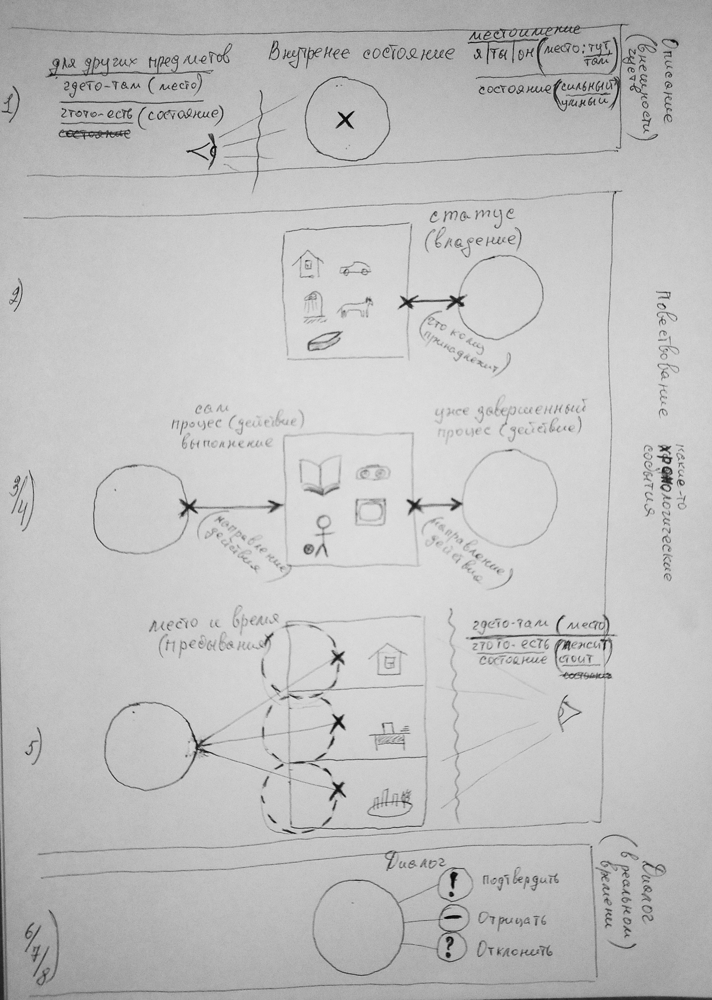

```
                       РЕЗЮМЕ
::::::::::::::::::::::::::::::::::::::::::::::::::::::
1. В английском языке простые предложения имеют строгий порядок: ИНИЦИАТОР ДЕЙСТВИЯ + САМО ДЕЙСТВИЕ + ПРЕДМЕТ ВОЗДЕЙСТВИЯ ~ ДОПОЛНЕНИЕ
2. С помощью глагола <действия> можно подчеркнуть время когда происходит это действие: периодично, прошлое, настоящее, будущее
3. Глагол <быть> можно использовать в НЕполных (абстрактных) предложениях: есть, иметь, находится, диалог
4. В абстрактных предложения для:
   - НЕфизических предметов используется <заглушка-время>
   - физических предметов используется <заглушка-место>
5. <инициатор действия> и <предмет воздействия> меняются (переворачиваются) местами в случаях:
    - когда речь идет об НЕживом предмете
    - когда <противоположность владеть>
    - когда предложение с условием
6. В английском языке выражение с условием формируется из 2-х простых фраз, которые объединяются союзом-условия
::::::::::::::::::::::::::::::::::::::::::::::::::::::
```

```
> В русском языке структура предложения формируются на основе окончаний (не завиимо от порядка слов в предложении).
  Склонение падежей:
  1. Називний .... хто? що?
  2. Родовий ..... кого? чого?
  3. Давальний ... кому? чому?
  4. Знахідний ... кого? що?
  5. Орудний ..... ким? чим?
  6. Місцевий .... на кому? на чому?


> А в английском языке структура предложения формируются на основе состояний.
  Глагол 'быть':
  - Описание
    1. Внутренее состояние (личное) ............. там где используются местоимения (я, ты, мы, он, они)
	                                                                ..... в местоимения уже заложен двойной смысл - указывает на личность и место действия:
																	      - я (это я, и всегда тут)
																		  - ты (это мой спутник, и всегда тут - со мной)
																		  - мы (это люди окружающие меня, и всегда тут - со мной)
																		  - он (это какой-то знакомый человек, и всегда там - где-то)
																		  - они (это какие-то знакомые люди, и всегда там - где-то)
                                                  Я есть счастливый ..... [am, is, are]
                                                ( I am hapy )
                                                ( Я читатель - I'm a reader )
    2. Внутренее состояние (других) ............. там где упоминаются конкретные Имена, название предметов (которые НЕимеют никакого отношения ко мне)
	                                                                ..... нужно явно указать на конкретную личность и место действия:
                                                ( Твоя мама там исчет тебя == There is your mother out to looking for you )
  - Повествование предложение (хронологические события)
    3. Статус (владение) ........................ Я имею дом ............ [have, has]
                                                ( I have the hous )
    4. Сам процесс (действия) выполнения ........ Я читаю книгу ......... [do, does, use, can, would, into, out to, from, +ing] (read, found)
                                                ( Я читаю (сейчас) книгу - I reading the book )
    5. Уже завершенный процесс (действия) ....... Я прочитал книгу ...... [get, give, made, had, done, +ed]
                                                ( Книга быть прочитана - The book was read for me )
                                                ( Я прочитал (уже) книгу - I read the book )
                                                ( Я закончил читать книгу - I finished read the book )
    6. Место и время (пребывания) ............... Я в Лондоне ........... [was, be, will,, +ed, +ing]  [in, on, at]  [this, that, these, those, there +]
                                                ( I in London )
                                                  Я в дома
                                                ( I at home )
  - Диалог (в реальном времени)
    7. Подтвердить .............................. Да, я есть ............ [yes]
                                                ( Yes, I am )
    8. Отрицать ................................. Нет, я нет ............ [not, don't]
                                                ( No, I am not )
    9. Спросить ................................. Ты делаеш? ............ [what, who, where]
                                                ( What You name? )
  10.1 Обращение ................................ Уважаемые пассажиры, наш поезд прибывает (дорогие рассажиры, пожалуйста ваше внимание) .... Your attention please, dear passengers, the train enters
  10.2 Просьба .................................. Давайте пойдем (вперед) ................................................................... Let's go
                                                  Скажите пожалуйста (пожалкйста, расскажите мне) ........................................... Tell me please

> Помимо этого, в помощь глаголу 'быть', в английском языке существуют:
  - Местоимения ................................. я, ты, мы, он они ..... считается что местоимения имеют предопределенное состояние:
                                                                          Я (тут), Ты (тут), Мы (тут), Он (там), Они (там)
                                                                          Моя мама, эта мама, та мама
  - Предлоги .................................... этот, тот, тут, там ... применяются в предложениях чтобы определить напрвление действия:
                                                                          Я читаю эту книгу, Та картина очень красивая

Слова которые связаны по смыслу внутри предложения, которые определяют место и время - используют предлоги (в, на) + союз (of) ...... System in front of Zoomer
Есть слова которые не несут за собой смысла места и времени - в этом случае не нужны дополнительные предлоги ........................ slowly walk forward
(System in front of Zoomer than slowly walk forward)

::::::::::::::::::::::::::::::::::::::::::::::::::::::
Когда какие-нибудь работа уже была выполнена - об этом моменте можно сказать, что:
1. сделанная работа
2. я <имел> сделанную работу
Состояние <сделанно> (в прошедшем) и <иметь> в английском языке может иметь одно значение, например:
( я читаю книгу - I reading the book ) действие выполняется в настоящий момент
- книга быть прочитана - The book was read.
- Автобус уже уехал прочь == автобус пішов від цієї станції (автобус має покинути цю зупинку) - The bus has left from this station
::::::::::::::::::::::::::::::::::::::::::::::::::::::
Состояние <быть> и <есть> в английском языке тоже имеет двойное значение:
1. я есть == это мое внутренее состояние
2. я быть в Лондоне (сменил свое место) | книга быть прочитана (сменила свое место-состояние) == чтобы указать местоположение для состояния кого-нибудь или чего-нибудь
   - (я читаю книгу) сейчас - (I read a book)
   - книга быть прочитана для меня - This book was read for me
::::::::::::::::::::::::::::::::::::::::::::::::::::::
В русском языке одним словом с помощью окончаний можно выразить разные состояния, например:
- Всегда за нами приезжает автобус.  [периодичность]
- А за нами приедет автобус?         [вопрос]
- За нами приедет автобус!           [утверждение]
- Автобус уже уехал!                 [утверждение]
Но в английском языке чтобы выделить конкретное состояние можно инначе перефразировать предложение, например:
- Нас возит автобус.                 [периодичность]
- А будет ли автобус?                [вопрос]
- Автобус будет!                     [утверждение]
- Автобус мав залишати зупинку.      [утверждение]
( выход на правую платформу == высвобождение с права )
::::::::::::::::::::::::::::::::::::::::::::::::::::::


Я делаю .................... I doing it
Я буду делать .............. I will do it
Я уже сделал ............... I did it already
Они ищут тебя .............. They out to looking for you
Они поймают тебя ........... You will catch for they

Они тебя найдут (Ты будеш пойман)
Там нарисованный клоун на стене (Нарисованный клоун быть на той стене)
Тебя исчет мама (Там есть мама где-то искать тебя)

Furthermore, Moreover, - кроме того, более того
inside / outside (side) = внутреняя / внешняя (сторона)
in to / out to (to) = во внутрь / во внешний... (к)
anywhere - нигде
everybody - каждый (много)
somebody - кто нибудь (один)
anyone, anybody - никто, любой (ниодин)
```

[підмет присудок додаток означення обставина](https://www.google.com.ua/search?q=підмет+присудок+додаток+означення+обставина&tbm=isch&tbo=u&source=univ&sa=X&sqi=2&ved=0ahUKEwjk-7XZs-nSAhUJKpoKHWFeDTsQsAQIFw&biw=1467&bih=725) **(** [еще](https://www.google.com.ua/imgres?imgurl=http%3A%2F%2Fwww.chasipodii.net%2Fpix%2Fimg_17806_2_1.jpg&imgrefurl=http%3A%2F%2Fwww.chasipodii.net%2Fmp%2Farticle%2F2051%2F&docid=I8HALmE2mt0ZBM&tbnid=nUNsT5mortfHcM%3A&vet=10ahUKEwis2aves-nSAhVsDJoKHS0YAfgQMwgqKBAwEA..i&w=640&h=219&bih=725&biw=1467&q=підмет%20присудок%20додаток%20означення%20обставина&ved=0ahUKEwis2aves-nSAhVsDJoKHS0YAfgQMwgqKBAwEA&iact=mrc&uact=8#h=219&imgrc=nUNsT5mortfHcM:&vet=10ahUKEwis2aves-nSAhVsDJoKHS0YAfgQMwgqKBAwEA..i&w=640) **)**

```
В русском и английском языках, правила для построения предложений (ПIДМЕТ + ПРИСУДОК + ДОДАТОК) - работают по разному.

------------------------------------------[ ИМЕТЬ ]
Можно иметь какие-нибудь личные качества!
AM
+ Я есть знать ...... иметь (личные качества) знания
Это то что физически является частью меня-самого или кого-либо ... (руки, ноги, голова - части физического тела; мои чуства, мои ощущения; мои качества, мои знания, мой ум, мой опыт, моя сила, мой рост, мой цвет кожи; IT-разработчик, отец, сын, победитель - мой статус в обществе; мое имя;)
Это то что у меня нельзя отобрать ... (голос, рост, вес, привычки, его стиль;)
- - - - - - - - - - - - - - - - - - - - -
В русском языке есть просто какое-то абстрактное состояние... например:
- Что ты чуствуеш ? (состояние)
- Ты ощущаеш боль ? (состояние)
- Я голодный (состояние)
- Ты волшебник
- Ты сильный духом (у тебя большая сила воли)
В английском языке есть четкое определение для вещей которые попадают под этот критерий, например:
+ Мое имя есть Саша ................ (характеристика)   |   My name is Sasha
+ Я есть умный ..................... (характеристика)   |   I'm intelligent (smart)
+ Я есть успешный .................. (характеристика)
+ Я есть счастливый ................ (состояние)
+ Я есть чуствовать боль, запахи ... (состояние)
+ Я есть богатый человек ........... (состояние)
+ Какие у тебя есть чуства ? ....... (состояние)
+ Ты есть болен .................... (состояние)
+ Я есть голодный .................. (состояние)
+ Ты есть волшебник ................ (состояние)        |   You are a magic
+ Ты есть IT-разработчик ........... (состояние)

------------------------------------------[ ВЛАДЕТЬ ]
Можно владеть каким-либо предметом!
HAVE
> Это только мои личные (физические) вещи
> Это те вещи что я могу потратить только на себя (свои физические потребности) ... (кофе - выпить во внутрь; душ - принять на тело; квартира - чтобы согреться, для отдыха; деньги - потратить на свое удовольствие; работа - для своего-личного обогощения;)
> И то что у меня можно физически отобрать
- - - - - - - - - - - - - - - - - - - - -
В русском языке есть просто какое-то абстрактное действие, состояние... например:
- Я принимаю душ (делаю)
- Я пью кофе (делаю)
- У меня есть деньги (состояние)
- У меня есть рубашка (состояние)
- Я болею (состояние)
- Ты обладаеш магическим даром (владею)
- Ты обладаеш необыкновенной красотой (владею)
- Ты обладаеш огромной силой воли (владею)
В английском языке есть четкое определение для вещей которые попадают под этот критерий, например:
+ Я имею душ .......................... (владею)   |   I have a shower
+ Я имею кофе ......................... (владею)
+ Я имею деньги ....................... (владею)   |   I have more many
+ Я имею рубашку ...................... (владею)
+ Я имею жизнь ........................ (владею)
+ Ты имееш чуство боли ? .............. (владею)
+ Ты имееш магические способности ? ... (владею)

------------------------------------------[ ДЕЛАТЬ ]
Можно (просто) делать какую-нибудь работу!
DO, _ING
Это то что просто (описывает) указывает на любое действие
Это НЕпривязывает ни к месту где выполняется действие И НЕуказывает на владение предметом...
- - - - - - - - - - - - - - - - - - - - -
В английском языке есть четкое определение для вещей которые попадают под этот критерий, например:
+ Я читаю книгу (делаю)
+ Я слушаю музыку (делаю)
+ Я делаю домашнее задание (делаю)

------------------------------------------[ МЕСТО-ПРЕБЫВАНИЯ ]
Можно где-то находиться в какой-то момент времени!
BE, WILL, WAS, _ED
Это мое физическое место нахождения (И в физическом пространстве И во времени) ... (дома, на работе, на отдыхе; вчера, год назад, сегодня, завтра, в будущем;)
Это просто указывает на место И время где / когда Я или кто-либо находится...
- - - - - - - - - - - - - - - - - - - - -
В русском языке есть какое-то конкретное место и время... например:
- Я сижу дома
- Я собираюь в Лондон
- В прошлом году я ездил в Париж
В английском языке есть четкое определение для вещей которые попадают под этот критерий, например:
+ Я есть в дома ......................... (место)           |   I'm at home
+ Вчера я был в театре .................. (место + время)   |   Yesterday I was at theatre
+ Я буду на работе ...................... (место + время)   |   I'll at work
+ Один год назад я был в Париже ......... (место + время)   |   One year ago I was in Paris
+ Я буду в Лондоне ...................... (место + время)   |   I will in London

------------------------------------------[ УКАЗАТЬ НА ПРЕДМЕТ ]
Там стоят-есть стулья (Тут стоит-есть картина)
THERE, THAT
> Это указывает на точное место где находится предмет
- - - - - - - - - - - - - - - - - - - - -
В русском языке есть какие-то конкретные предметы... например:
- Здесь стои стол
- Вот (на этом столе) лежит книга
- Там стоят стулья
- Там лежат карандаши
- Тут висит картина
В английском языке есть четкое определение для вещей которые попадают под этот критерий, например:
+ Это есть стол ........ (указатель места нахождения)   |   This is the table
+ Это есть книга ....... (указатель места нахождения)   |   This is the book
+ Там есть картина ..... (указатель места нахождения)   |   Those is the artistic picture
+ Там есть стулья ...... (указатель места нахождения)   |   These are chairs
+ Там есть карандаши ... (указатель места нахождения)   |   These are pencils

------------------------------------------[  ]
Можно что-нибудь иметь (возможность сделать, но НЕхотеть)!
CAN

------------------------------------------[  ]
Можно что-нибудь хотеть (но НЕиметь возможности)!
WOULD

------------------------------------------[  ]
Вещи которые безусловно нужно (должны) сделать!
SHOULD, NEED

------------------------------------------[ ПЛАНЫ НА БУДУЩЕЕ - ПРЕДСКАЗЫВАТЬ ]
GOING TO

------------------------------------------[ БЫЛО В ПРОШЛОМ ]
HAVE BEEN


>  Но я знаю как правильно строить предложения на английском   |   (сложное предложение можно разделить на простые по смыслу предложения)
   ---------------------------------------------------------
0. Но ................................................     |       (предлог или обстоятельства:)
1. ... я знаю ........................................     |       (основная часть предложения: мои личные качества) я знаю
2. ... как правильно строить предложения на английском     |       (дополнение для предложения: упростить название) правила для построения английского предложения
   =========================================================
1. (для основной части предложения применяется: ПРАВИЛО ПОЛНОГО ПРЕДЛОЖЕНИЯ = ПIДМЕТ + ПРИСУДОК + ДОДАТОК)
.. (для остальной части предложения применяются: ДОПОЛНЕНИЯ ДЛЯ ОБСТОЯТЕЛЬСТВА ВРЕМЕНИ И МЕСТА)
   ---------------------------------------------------------
   But I'm know to rule for build a sentence of English


   Я думаю что мне нужно больше разговаривать на английском языке  >>  Я есть думать то-что я нужно больше разговаривать по английски
   --------------------------------------------------------------
   I'm think that I need to more speak English

   Кто-нибудь собирается послушать мою историю?  >>  Там есть кто-нибудь для будет слушать мою истоию?
   ---------------------------------------------------
   Is there anybody for gooing to listen the my story?

+++++++++++++++++++++++++++++++++++++++++++++++++++++++++++++++++++++++++++++++++++++++++++
В русском языке порядок слов не имеет никакого значения (в английском языке наоборот все зависит от порядка слов).
Любое предложение имеет:
+ главные члены (ПIДМЕТ ПРИСУДОК)
+ и второстепенные члены (ДОДАТОК ОЗНАЧЕННЯ ОБСТАВИНА)

В обычном разговоре, большенство предложений имеют сложную форму, например:
> Кто-нибудь собирается послушать мою историю? === Кто-нибудь послушать
> Я думаю что мне нужно больше разговаривать на английском языке === Я думаю
> Я слушаю музыку === Я слушаю
Если такие сложные предложения разбить на простые смысловые блоки, например:
= Кто-нибудь
     собирается послушать мою историю (послушать историю)?
= Я думаю
     что мне нужно больше разговаривать (нужно разговаривать)
        на английском языке
= Я слушаю музыку

В русском языке порядок слов не имеет никакого значения.
В английском языке (наоборот) все зависит от порядка слов. И всегда этот порядок слов должен быть таким (как минимум): ... + ПIДМЕТ + ПРИСУДОК + ДОДАТОК + ...
Дело в том что в английском языке в НЕправильных (НЕполных) предложениях слова меняют свое значение, например (всегда предложение должно иметь полную форму):
> Кто-нибудь === Есть там кто-нибудь >> Is there anybody
     ...?
> Я думаю === Я есть думать >> I'm think
     ...
        ...
> Я слушаю музыку === Я слушаю музыку >> I listen to music

+ + + + + + + + + + + + + + + + + + + + + + + + + + + + + + + + + + + + + + + + + + + + + +
I was in London (I have been in London) === Я был в Лондоне.
I will in London === Я буду в Лондоне

I'm going to London === Я еду в Лондон
I'm leaving for London === Я уезжаю в Лондон (я есть оставлять для Лондона)

+ + + + + + + + + + + + + + + + + + + + + + + + + + + + + + + + + + + + + + + + + + + + + +
> В русском языке можно оперировать окончаниями:

> В английском языке можно оперировать только (состоянием + порядок слов):
  + Есть | Является (внутренее состояние)
  + Имеет (владеть)
  + Быть (место - there is|are...; это не может быть - it can't be; это не еально - it's not really; но что есть реальность - but what is a really;)
  + Делаю (Выполняется - в процессе) | Занимаюсь (мое хобби есть..., я есть IT-разработчик, ...) | Брать (принимать участие | брать уроки, ...)
  + Сделано (уже выполнено) | Получить
> Плюс такие себе союзы, чтобы связывать части сложного предложения:
  + and | of | for | from | in | that | what | to (into | out to) | even | ...

- - - - - - - - - - - - - - - - - - - - - - - - - - - - - - - - - - - - - - - - - - - - - -
На практике, во время беглой речи, сложно запоминать большое количество английских фраз.
Особенно еще когда встречаются неизвестные английские слова.

Дело в том, что каждая фраза несет в себе определеную смысловую нагрузку.
И весь этот порядок фраз связывается между собой смысловой цепочкой...
(стоит только напомнить смысл как сразу на ум прийдет-вспомнится  вся фраза целиком)

Поэтому если какая-либо фраза из-за плохого перевода осталась недопонятой
- из-за этого теряется ее смысл и разрывается смысловая цепочка...
Поэтому так трудно запоминать большое количество английских фраз!
(главное правильно выделять подлежащее и сказуемое из английского предложения и учиться строить в голове смыловую цепочку...)

В определении подлежащего есть важный момент - артикли перед существительным могут определять: время (дополнительно), место, профессию, просто неживой предмет или одушевленное тело...
А перед сказуемым есть артикли которые могут определять: направление движения, тип действия, время (основное) выполнения, ...
(А также подлежащие могут быть являться словосочетанием из нескольких слов, которые описывают предмет...)
1. Поэтому, если отлавливать-осознавать такие аспекты в английских фразах - можно выделять смысл предложения!
2. И учиться строить английские фразы по каждому конкретному смылу (чтобы потом этот смысл можно было воспроизвести - в обратном порядке)!
3. То есть, нужно учиться слушать одновременно несколько английских фраз (более одной) и учиться их запоминать + в след повторять (пытаться воспроизвести-восстановить порядок услышанных фраз)!


  age ............... возраст
  young ............. молодой
  old ............... старый
  place ............. место
  edge .............. край
  space ............. пространство
  area .............. область (площадь)
  a young space - молодое поколение
  a old space - старое поколение

  yet | still ....... еще (все еще)
  already ........... уже
  live .............. живой
  still alive ....... еще живой
  survive ........... выживать

  state ............. состояние
  static ............ неподвижный
  stop (stoping) .... остонавливаться (прекращать)
  stand ............. стоять (на ногах)
  freeze ............ замерзать
  constant .......... постоянный
  ( static state - неподвижное состояние )

  middle ............ средний
  middleware ........ промежуточное ПО
  broker ............ посредник
  transit (transition) - переход (переходный период)

  current ........... текущий
  duration .......... продолжительность
  ( Персистентность — продолжительность сохранения, активности в окружающей среде )
  persistent - непрерывно возобновляющийся (persistent object - постоянный объект)

  fall .............. падать
  broke ............. ломать
  thought ........... через (сквозь)
  something that broke thought insite me (some broke throught for me) - что-то прорвалось во мне

  Быть
  ----
  > I can be... ..... находиться (пребывать) в каком-нибудь внутреннем состоянии
  > There is|are... . находиться (пребывать) в каком-нибудь физическом месте
  I can be a strong - Я могу быть сильным
  I will a strong (I'll a strong) - Я буду сильным
  I will become a strong (I'll become a strong) - Я стану сильным
  Now I in London (Now I'm in London) - сейчас я в Лондоне.
  But tomorrow I'll in Egypt - но завтра я буду в Египте


> Например:
  + Я могу выполнять задачи вовремя даже в случае возникновения сложностей...
       I can give my work done even in the face difficult obstacles... (я могу получить свою работу успешно даже перед лицом сложных препятствий)
  + стэк - хранит только локальные переменные примитивных типов и ссылки на объекты в куче
       стэк есть (является) областью памяти для локальных примитивных типов и ссылочных типов из области кучи
	   The stack is some memmory space for locale of type primitive and link type from at heap.
  + управления памятью осуществляется по схеме LIFO (первый вошел - последний вышел)
       управление памятью использует схему LIFO (если первый является вошедшим - тогда он будет последним на выход)
	   The memmory control used a LIFO shema (if some first item is entered then his will last item for output)
  + стэковая память существует лиш на короткое время для работы отдельной под-программы
       стэковая память имеет (владеет) коротким временнем для отдельного процесса под-программы
	   The memmory area has the short time for separate of a programm process.
  + стэк может использоваться только одним потоком исполняемой программой (стэковая память НЕможет быть доступна для других потоков)
       стэк имеет только один поток для запущенной программы (стэковая память не имеет доступ для других потоков)
	   The stack has only one thred for a runner programm (some area of stack memmory ish't available for another threads).
```


```
> В русском языке можно:
  + (есть и простые/примитивные предложения)
  + (выбросить из предложения все те слова что указывают на: время и место действия, тип действия, иннициатор, порядок слов - все такое абстрактное...)
  + строить предложения только из 1-го слова, которое выражает основную идею...
  + можно в 1-ом предложении выразить много идей...
  + можно построить такое предложение, которое будет состоять только исключительно из идейных слов (и выражать много идей)...
  Пример:
          0. "Картина 19 века, художника Комарова - Осень"
          1. Здесь вы видите картину (Это - картина)"
          2. "Она называется Осень"
          3. "Эта картина написана в 19 веке"
          4. "Ее написал художник Комаров"
> В английском языке любое/простое предложение должно иметь:
  - только 1-но слово, которое выражает основную идею (содержать не больше)
  - строгий устоявшийся шаблон слов (порядок слов, время и место действия, тип действия, иннициатор - являются обязательными и имеют специальное предназначение...)
  - делить сложное предложение на простые: для выражения каждой отдельной идеи (слова которые выражают идею) строить отдельное новое предложение
  - объязательно указывать время и место действия
  - объязательно указывать тип действия и иннициатора
  - в качестве дополнения: использовать связки из нескольких слов (но само по себе 1-но слово не имеет никакого значения)
  ~ ( только: 1-у идею; 1-о время и место действия только; 1-ин тип-предложения (шаблон: состояние|поведение|вопрос|обстоятельство); )


-------------------------------------[ 1 - вспомогательные конструкции ]
В английском языке, само по себе 1-но слово - не имеет никакого значения.
Но существую (вспомогательные конструкции) специальные связки из нескольких слов, которые внутри предложения могут уже что-то обозначать.
1. (обязательные) Слова указывающие на время действия:
   ~ <going to, ing, ed> и <will, was, were, am, is, are>
2. (дополнительные) Слова характеризирующие предмет:
   ~ Неодушевленный (физический) предмет ... A / The
   ~ Название предмета ..................... The <ЧТО>
   ~ Название проффесии .................... A / An
   ~ Притяжательность ...................... <ЧЬЕ>+S <ЧТО>
   ~ Указывающие на количество ............. <much, many, few, little, a lot of>
   ~ Вопросительные слова .................. <WHAT, WHO, WHERE, WHEN, WHY, HOW> <..>
   ~ Отрицание/противоположность ........... <..>+NOT
   ~ Направленное действие (обращение к) ... To <ЧТО ДЕЛАЕТ>
3. (уточняющие) Слова обстоятельства времени и места действия:
   ~ Указывающие на время действия ......... <at, on, in the> и специальные: <next, last, this, that, one, any, each, every, some, all>
   ~ Указывающие на место действия ......... <at, on, in the> и специальные: <next to, beside, by, under, below, into...>

-------------------------------------[ 2 - простые предложения ]
Правила построения простого предложения в английском языке:
> В каждом предложении должна быть заложенная основная идея... и на нее будет указывать только одно-единственное слово (в котором и будет заложена основная идея для всего предложения).
  Слова, которые выражают (несут) основную идею предложения, условно можно поделить на типы:
  1. Выражает внутреннее состояние объекта.
     Это короткие предложения, которые имеют законченный смысл.
     ~ в таком предложении слово, которое выражает идею - является СУЩЕСТВИТЕЛЬНЫМ...
  2. Описывает какое-нибудь поведение.
     Это длинные предложения, которые описывают действия...
     ~ в таком предложении слово, которое выражает идею - является ГЛАГОЛОМ...
  3. Чтобы спросить о чем либо.
     Может использоваться для всех случаев...
     ~ в таком предложении вопросительное слово, которое выражает идею - является (СПЕЦИАЛЬНЫМ-ДОПОЛНЕНИЕМ), оно должно стоят самым первым в предложении и меняет порядок слов в предложении...
  4. Уточняют детали обстоятельства.
     Может использоваться только как дополненние в сочетании либо с выражением внутреннего состояния или с описанием поведения или с вопросом (самостоятельно НЕиспользуется)..
     ~ в таком предложении уточняющее слово, которое выражает идею - является ПРИЛАГАТЕЛЬНЫМ (которое дополняет либо существительное либо прилагательное)...
> 5-Шагов для построения простого предложения в английском языке:
  1. В английском языке любое предложение (даже самое простое) всегда должно описывать какое-нибудь действие (даже если нисчем ничего не происходит...)
     Поэтому, предварительно можно составить общий шаблон для пустого предложения, которое нисчем ничего не делает... и одинаково подходит для всех случаев:
     ~ для внутреннего состояния: 'THERE IS A THING' <ТАМ ЕСТЬ ВЕЩЬ>
     ~ для какого-нибудь поведение: 'IT IS THING' <ОНО ЕСТЬ ВЕЩЬ>
     ~ для вопроса: 'IS IT|THERE A|THING ?' <ЕСТЬ ОНО|ТАМ ВЕЩЬ ?> или 'WHERE IS IT|THERE A|THING ?' <ГДЕ ЕСТЬ ОНО|ТАМ ВЕЩЬ ?>
  2. В английском языке такое единственное слово, которое выражает идею для всего предложения, всегда ставится в конце этого предложения. И - заменяет 'ВЕЩЬ'
     ~ <ОНО БЫТЬ идея>
  3. В любом предложении есть иннициатор и тип действия (ПIДМЕТ и ПРИСУДОК). И - заменяют (иннициатор) 'ОНО', а (тип действия) 'БЫТЬ'
     ~ <иннициатор тип-действия идея>
  4. В английском языке предложение всегда должно указывать в каком периоде времени происходит это действие. И к глаголу 'БЫТЬ' добавляется либо 'ED', либо 'ING', либо 'GOING TO' (или заменяется WAS/DAS/WILL)
     ~ для внутреннего состояния:  <иннициатор WAS/DAS/WILL идея>
     ~ для какого-нибудь поведение: <иннициатор GOING TO+тип-действия+ING/ED идея>
     ~ для вопроса: <GOING TO+тип-действия+ING/ED иннициатор идея ?> или <ГДЕ+ GOING TO+тип-действия+ING/ED иннициатор идея ?>
  5. Слова уточняющие детали обстоятельства, не являются обизательными в английском предложении и можно указывать по желанию
     ~ <МЕСТО-ВРЕМЯ + иннициатор GOING TO+тип-действия+ING/ED идея> или <иннициатор GOING TO+тип-действия+ING/ED идея + МЕСТО-ВРЕМЯ>

-------------------------------------[ 3 - сложные предложния ]
Но дело в том что на практике, сами по себе такие простые предложения тоже не имеют никакого практического значение (применения)...
На практике, обычно все предложения являются повествовательными - это те которые подтверждают что-либо (статус...) через реальные-бывалые события из в истории происходящего...
> Такие повествовательные предложния объединяют в себе несколько простых предложений (являются сложными предложениями), и могут иметь:
  + несколько идей
  + несколько времен и мест действий
  + несколько типов-предложений (шаблон: состояние+поведение+обстоятельство+вопрос)
> Правила для построения сложного предложния в английском языке:
  1. Попытаться выделить все те идеи (основные слова которые выражают эти идеи)
  2. Определить тип(ы) для всех этих слов (выражающих идеи: состояние|поведение|вопрос|обстоятельство)
  3. Сначала по отдельности построить простые предложения для каждого слова выражающего отдельную идею...
  4. Потом использовать теже-самые правила порядка слов и шаблоны (состояние|поведение|обстоятельство|вопрос) для сложного предложения чтобы выстроить порядок из простых предложений...
     ~ то есть, для сложного предложении, (целые) простые предложения по своей смысловой нагрузке (абстрактно) могут замещать: идею, ПIДМЕТ, ПРИСУДОК, иннициатор, тип-действия, обстоятельства...


Пример, распределяем смысловую нагрузку предложения.
- В русском языке, одно предложение может выражать несколько идей одновременно...
   > например: эта картина была написана в двадцатом веке великим художником Ивановым.
- Но в английском языке, одно предложение может выражать только одну идею...
   > например: эта картина была создана в двадцатом веке. (This picture was creat at twentieth century.)
   >           это есть картина Иванова. (It is Ivanovs picture.)
   >           Иванов был великим художником. (Ivanov were a greatest artist.)
   ++++++++++
   Я - Саша.
   Мое имя есть Саша.
   ---
   Позвольте представиться.
   (Позвольте мне представиться?) Позвольте мне информировать о себе?
   ---
   Сложно описать себя.
   Это есть сложно для описать себя.
   ---
   Вообще-то говорить о себе много хороших слов не слишком-то скромно...
   <ДЕЙСТВИЕ ПО НАПРАВЛЕННОЮ К> говорить (много) хороших слов <УТОЧНЕНИЕ> о себе <СКАЗУЕМОЕ> является очень не скромно
   ---
   Самое сложное – это рассказать о себе что-то объективное...
   является самым сложным
     рассказать
       (что-нибудь) какие-нибудь вещи об себе
   The most difficult thing is to tell something objective about myself...
   ---
   Кто-нибудь собирается послушать мою историю?
   (кто-то есть там | там кто-то есть) есть там кто-то?
     что-то собираться (сделать) послушать
	   (что...) моя история
   ---
   Непросто говорить о себе
   (непросто=сложно) это есть сложно
     (...делать для) говорить об
   ++++++++++
   ---
   Я - Саша.
   Меня зовут Саша.
   Мое имя есть Саша. == My name is Sasha.
   ---
   Позвольте представиться.
   (Позвольте мне представиться?)
   Вводить в курс oб / информировать...
   Позвольте мне ввести о себе. == Let me introduce myself.
   ---
   Сложно описать себя.
   Это есть сложно чтобы описать себя.
   It is difficult to describe myself.
   ---
   Вообще-то говорить о себе много хороших слов не слишком-то скромно...
   (ДЕЙСТВИЕ ПО НАПРАВЛЕННОЮ К) говорить (много) хороших слов (УТОЧНЕНИЕ) о себе  является очень не скромно == To tell many good words about yourself is not very modest...
   ---
   Самое сложное – это рассказать о себе что-то объективное...

   The most difficult thing is to tell something objective about myself...
   ---
   Кто-нибудь собирается послушать мою историю?
   (кто-то есть там | там кто-то есть) есть там кто-то?
     что-то собираться (сделать) послушать
	   (что...) моя история
   Is there anybody going to listen to my story?
   ---
   (собирается послушать = going to listen)
   ---
   Непросто говорить о себе
   (непросто=сложно) это есть сложно
     (...делать для) говорить об
   It is hard to speak about myself

   поскольку только люди со стороны могут видеть меня объективно
   (люди со стороны) окружающие меня люди
     видеть (могут видеть)
	   объективно (я объективный)
   people surrounding me can see me objectively

   Непросто говорить о себе, поскольку только люди со стороны могут видеть меня объективно.
   It is hard to speak about myself as only people surrounding me can see me objectively.
```


```
> По правилам английского языка, начало любого предложения может строится только со слов:
  - есть, иметь, быть, делать + мочь, хотеть, там есть.
> А в случае когда вопрос, тогда впереди должно стоять вопросительное слово:
  - что? кто? где? когда? сколько?
> Самым первым должно стоять местоимение <слово-указатель> + <действие>:
  - Я, Он, Она, Мы, Они, <Имена> + <действие>
> Все последующие слова - являются уточнением времени и места.
- - - - - - - - - - - - - - - - - - - - - - - - - - - - - - - - - - - - - -
> Перед всеми указательными словами (местоимениями) НЕнужны уточняющие предлоги:
  - Я, Он, Она, Мы, Они + <Имена>
> Для всех остальных слов которые указывают на предмет или на существо Нужны уточняющие предлоги места и количества:
  - Этот <есть> человек, Там <есть> чужак, Здесь <есть> стулья...
  + (в этом случае выражение полностью заменяет: <местоимение> + <действие>)
= = = = = = = = = = = = = = = = = = = = = = = = = = = = = = = = = = = = = =
> В английском языке слова-действия могут иметь только физическое значение (в английском языке Отсутствует переносный смысл для слов-действия):
  - Открывать дверь, Открывать конверт, Решать проблему, Делаю решение, Могу решать тайну, Смотреть поведение твое, ...
+ + + + + + + + + + + + + + + + + + + + + + + + + + + + + + + + + + + + + +
> В русском языке (можно сказать просто):
  - "Чужак ищет тебя" (ПIДМЕТ + ПРИСУДОК + ДОДАТОК)
> Но в английском языке есть направление действия, например (всегда нужно указывать место + направление действия):
  - Там есть чужак, снаружи -> ищет тебя (There is a stranger out to find you)
  Например:
  - Я смотрю телевизор = Я просто смотрю какой-то телевизор.
  - Я смотрю в окно = Я просто смотрю куда-нибудь в окно.
  Но:
  - Я ищу ключи = Я конкретно здесь ищу свои ключи.
  - Я ищу тебя = Я конкретно там ищу где-то во внешнем мире тебя.

+++++++++++++++++++++++++++++++++++++++++++++++++++++++++++++++++++++++++++++++++++++++++++
Обычно, в разговорной речи, большая часть предложений являются абстрактными - те которые не имеют конкретного места и времени действия.
Кроме этого, есть и такие абстрактные предложения в которых даже сами действия являются абстрактными.
Таких предложений очень много в разговорной речи и в большинстве случаев такие формы предложений очень похожи друг на друга!
------------------
  + Возле вас свободно? >> Скажите мне пожалуйста, является это место свободное?
  + Открыта дверь и поэтому очень холодно >> Там есть открытая дверь на улицу и поэтому здесь есть очень холодно
  + Я пойду на работу чтобы заработать деньги >> Я планирую (в будущем) иметь роботу для того чтобы получать деньги
  + Но я найду хорошую работу и буду еще больше зарабатывать денег >> Но я есть планирую (в будущем) найти для хорошую работу. И тогда я иметь получать больше денег
  + Мне тяжело работать. Сейчас сложный период и нам всем очень тяжело. Но потом будет легче >> Сейчас я есть тяжело для работы. Этот период является очень сложным для нас. Это есть причина для нам всем очень тяжело сейчас. Но нам будет легко.
  + Кто нибудь собирается слушать мою историю? >> Там есть кто-нибудь для слушать (в будущем) мою историю?
  + Непросто говорить о себе, поскольку только люди со стороны могут видеть меня объективно >> It is hard to speak about myself as only people surrounding me can see me objectively
  + Местро левобережная, выход на правую платформу >> Левобережная станция с освобождением -> право
  + Поезд киев-Москва прибывает на третью платформу. >> Внимание. Уважаемые пассажири, поезд Киев-Москва входит -> платформа №3   |   Please attention. Dear passenger, now the train Kiev-Moskow entrance to third platforms.
  + Нужно немного подождать и будет хорошо. А я пока буду подтягивать свой английский >> Сейчас мы должны быть малость ожидать. Но сейчас я буду практиковать для английский язык
  + А помниш вопрос что будет когда 'return' внутри 'try/catch'? >>
```


| `Уровень`                      | Настроение             |
| ------------------------------ | ---------------------- |
|        | LOVE `любить`          |
|        | LIKE `нравиться`       |
|  | DON'T MIND `не против` |
|  | DON'T LIKE `не любить` |
|        | HATE `ненавидить`      |


[Past Simple & Present Perfect](http://ruthhernandezcornejo.blogspot.com/)

|     |    `PRESENT SIMPLE`     |      `PAST SIMPLE`      |    `PRESENT PERFECT`    |                         |
|:---:| ----------------------- | ----------------------- | ----------------------- | ----------------------- |
|     |       *Настоящее*       |       *Прошедшее*       | *Прошедшее (причастие)* |                         |
|     | ----------------------- | ----------------------- | ----------------------- | ----------------------- |
| 1.  | cut        `кат`        | cut        `кат`        | cut        `кат`        | резать                  |
| 2.  | let        `лэт`        | let        `лэт`        | let        `лэт`        | позволять               |
| 3.  | put        `пут`        | put        `пут`        | put        `пут`        | класть / ложить         |
| 4.  | shut       `шут`        | shut       `шут`        | shut       `шут`        | преградить / затворять  |
| 5.  | cost       `кост`       | cost       `кост`       | cost       `кост`       | стоить                  |
|     |                         |                         |                         |                         |
| 6.  | hit        `хэйт`       | hit        `хэйт`       | hit        `хэйт`       | ударять / попадание     |
|     | - - - - - - - - - - - - | - - - - - - - - - - - - | - - - - - - - - - - - - | - - - - - - - - - - - - |
| 7.  | get        `гэт`        | got        `гот`        | got        `гот`        | получать                |
| 8.  | sit        `сит`        | sat        `сэт`        | sat        `сэт`        | сидеть                  |
|     |                         |                         |                         |                         |
| 9.  | meet       `миит`       | met        `мэт`        | met        `мэт`        | встречать               |
| 10. | keep       `киип`       | kept       `кэпт`       | kept       `кэпт`       | держать                 |
| 11. | feel       `фиил`       | felt       `фэлт`       | felt       `фэлт`       | чувствовать             |
| 12. | leave      `лиив`       | left       `лэфт`       | left       `лэфт`       | оставлять               |
| 13. | sleep      `слип`       | slept      `слэпт`      | slept      `слэпт`      | спать                   |
|     |                         |                         |                         |                         |
| 14. | lend       `лэнд`       | lent       `лэнт`       | lent       `лэнт`       | давать взаймы           |
| 15. | send       `сэнд`       | sent       `сэнт`       | sent       `сэнт`       | отправлять              |
| 16. | spend      `спэнд`      | spent      `спэнт`      | spent      `спэнт`      | тратить                 |
| 17. | build      `билд`       | built      `билт`       | built      `билт`       | строить                 |
| 18. | learn      `лерн`       | learnt     `лернт`      | learnt     `лернт`      | учиться                 |
| 19. | lose       `лууз`       | lost       `лост`       | lost       `лост`       | терять                  |
|     |                         |                         |                         |                         |
| 20. | catch      `кэч`        | caught     `каутс`      | caught     `каутс`      | поймать                 |
| 21. | buy        `бай`        | bought     `бутс`       | bought     `бутс`       | купить                  |
| 22. | bring      `брин`       | brought    `боутс`      | brought    `боутс`      | приносить               |
| 23. | think      `синк`       | thought    `соутс`      | thought    `соутс`      | думать                  |
| 24. | teach      `тич`        | taught     `тоутс`      | taught     `тоутс`      | учить                   |
|     | - - - - - - - - - - - - | - - - - - - - - - - - - | - - - - - - - - - - - - | - - - - - - - - - - - - |
| 25. | can        `кэн`        | could      `кууд`       | could      `кууд`       | можно                   |
| 26. | pay        `пэй`        | paid       `пэйд`       | paid       `пэйд`       | платить                 |
| 27. | say        `сэй`        | said       `сэйд`       | said       `сэйд`       | сказать                 |
| 28. | have       `хэв`        | had        `хэд`        | had        `хэд`        | иметь                   |
| 29. | make       `мэйк`       | made       `мэйд`       | made       `мэйд`       | делать                  |
|     |                         |                         |                         |                         |
| 30. | win        `вин`        | won        `вон`        | won        `вон`        | побеждать               |
|     |                         |                         |                         |                         |
| 31. | tell       `тэлл`       | told       `туд`        | told       `туд`        | рассказывать            |
| 32. | sell       `сэлл`       | sold       `соуд`       | sold       `соуд`       | продавать               |
| 33. | stand      `стэн`       | stood      `студ`       | stood      `студ`       | стоять                  |
| 34. | understand `андэстэнд`  | understood `андэстууд`  | understood `андэстууд`  | понимать                |
|     |                         |                         |                         |                         |
| 35. | find       `файнд`      | found      `фоуд`       | found      `фоуд`       | находить                |
| 36. | hear       `хиа`        | heard      `хеод`       | heard      `хеод`       | слышать                 |
|     | - - - - - - - - - - - - | - - - - - - - - - - - - | - - - - - - - - - - - - | - - - - - - - - - - - - |
| 37. | come       `кам`        | came       `кэм`        | come       `кам`        | приходить               |
| 38. | become     `бикам`      | became     `бикэм`      | become     `бикам`      | становиться             |
|     | - - - - - - - - - - - - | - - - - - - - - - - - - | - - - - - - - - - - - - | - - - - - - - - - - - - |
| 39. | drive      `драйв`      | drove      `дров`       | driven     `дривн`      | ездить                  |
| 40. | write      `райт`       | wrote      `рот`        | written    `ритн`       | писать                  |
|     |                         |                         |                         |                         |
| 41. | eat        `ит`         | ate        `эт`         | eaten      `итн`        | кушать                  |
|     |                         |                         |                         |                         |
| 42. | give       `гив`        | gave       `гэв`        | given      `гивн`       | давать                  |
| 43. | wear       `вир`        | wore       `вор`        | worn       `ворн`       | носить                  |
| 44. | speak      `спик`       | spoke      `спок`       | spoken     `спокн`      | говорить                |
| 45. | steal      `стил`       | stole      `стол`       | stolen     `столен`     | воровать                |
|     |                         |                         |                         |                         |
| 46. | wake       `вэйк`       | woke       `вок`        | woken      `вокн`       | просыпаться             |
| 47. | break      `брэк`       | broke      `брок`       | broken     `брокн`      | ломать                  |
| 48. | choose     `чууз`       | chose      `чооз`       | chosen     `чузн`       | выбирать                |
|     | - - - - - - - - - - - - | - - - - - - - - - - - - | - - - - - - - - - - - - | - - - - - - - - - - - - |
| 49. | grow       `гроу`       | grew       `грэу`       | grown      `гроун`      | расти                   |
| 50. | know       `ноу`        | knew       `нэу`        | known      `ноун`       | знать                   |
| 51. | throw      `сроу`       | threw      `срэу`       | thrown     `сроун`      | бросать                 |
|     |                         |                         |                         |                         |
| 52. | fly        `флай`       | flew       `флу`        | flown      `флоун`      | летать                  |
|     | - - - - - - - - - - - - | - - - - - - - - - - - - | - - - - - - - - - - - - | - - - - - - - - - - - - |
| 53. | take       `тэйк`       | took       `тук`        | taken      `тэккэн`     | брать                   |
| 54. | fall       `фоол`       | fell       `фэл`        | fallen     `фолэн`      | падать                  |
| 55. | forget     `фогэт`      | forgot     `фогот`      | forgotten  `фоготн`     | забывать                |
|     | - - - - - - - - - - - - | - - - - - - - - - - - - | - - - - - - - - - - - - | - - - - - - - - - - - - |
| 56. | begin      `бэгин`      | began      `бигэн`      | begun      `биган`      | начинать                |
| 57. | drink      `дринк`      | drank      `дрэнк`      | drunk      `дранк`      | пить                    |
| 58. | ring       `рин`        | rang       `рэн`        | rung       `ран`        | звонить                 |
| 59. | run        `ран`        | ran        `рэн`        | run        `ран`        | бежать                  |
| 60. | sing       `син`        | sang       `сэн`        | sung       `сан`        | петь                    |
| 61. | swim       `свим`       | swam       `свэм`       | swum       `свам`       | плавать                 |
|     | - - - - - - - - - - - - | - - - - - - - - - - - - | - - - - - - - - - - - - | - - - - - - - - - - - - |
| 62. | do         `ду`         | did        `дид`        | done       `дан`        | делать                  |
| 63. | go         `гоу`        | went       `вэнт`       | gone       `гон`        | идти                    |
|     | - - - - - - - - - - - - | - - - - - - - - - - - - | - - - - - - - - - - - - | - - - - - - - - - - - - |
| 64. | be         `би`         | was / were `воз / веер` | been       `бин`        | быть                    |
| 65. | see        `сии`        | saw        `со`         | seen       `син`        | видеть                  |


[Порядок слов в английском предложении](https://www.native-english.ru/grammar/word-order) **|** [1](http://iloveenglish.ru/stories/view/pishem_interesnij_rasskaz_o_sebe_na_anglijskom) **|** [2](http://skyeng.ru/articles/gotovimsya-k-sobesedovaniyu-na-anglijskom-yazyke-rasskaz-o-sebe?source_type=cpa&utm_source=admitad&admitad_uid=511c2f4ff8d950bec40ac453849847f6) **|** [3](http://tonail.com/рассказ-о-себе-на-английском/)

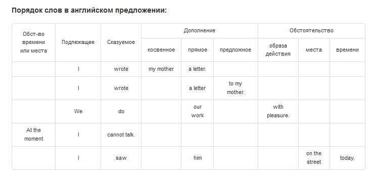

```
---------------[ Наречие `КОГДА ?` ]-------------------[ 1.
Above .......... выше
Absolutely ..... абсолютно
Always ......... всегда
Already ........ уже (уже сделал)
Back  .......... назад / обратно
Below .......... ниже
Counter Backward обратно / в обратном направлении
Direct ......... прямо
Exactly (Just) . точно / точь-в-точь / именно / как раз / совершенно верно (прямо в точку)
Excellent ...... отлично
Forever ........ навсегда
Further ........ в дальнейшем
Furthermore .... более того
Just ........... просто / как раз / только что / совершенно верно (точно, как раз, именно, поистине)
Quite .......... вполне / весьма / довольно / достаточно
Often Frequently  часто
Instead ........ вместо / взамен
In fact (Actually) ............. По факту / На самом деле
Immediately .................... Немедленно
Simply ......... просто
Straight ....... метко (прямо в яблочко)
Recently ....... недавно / в последнее время ................. (востанновления недавних событий в памяти, воспоминания)
Together ....... вместе
Therefore ...................... Поэтому / Следовательно

---------------[ Имя существительное `ЧТО ?` ]---------[ 2. || дополнение
Appointment .... деловое свидание / условленная встреча
Ability ........ способный ................................... (он имеет возможность/способность быть обильным/щедрым)
Activity ....... деятельность
Addition ....... дополнение
Acquisition .... приобретение
Advantage ...... преимущество
Agreement ...... согласие
Approach ....... подход (подход к решению)
Approximately .. примерно / приближенное значение
Appliance ...... Электрический бытовой прибор (device...прибор)
Assignment ..... присваивание
Attention ...... внимание
Advantage ...................... Преимущество
Attempt ........................ Попытка
Accordance (According to) ...... Соответствие (В соответствии с)
Being .......... являющийся / существующий (бытие)
Behavior Conduct поведение
Blend .......... смесь
Case (happen) .. случай / обстоятельство / прецедент / какое-то дело (судебное дело, засвидетельствованный случай, достоверный случай)
Сause Reason ... причина
Contribution ... взнос / вклад
Compete ........ конкурировать / состизаться / соревноваться
Challenge ...... сложная задача / проблема (вызов ~ как на соревнование) ................... (челенджер много дисков, сложный)
Contraction .... сокращение (выразить в сокращенной форме)
Сonfidence ..... доверие (достоверность)
Conventions .... условность (соглашение)
Contract ....... договор
Companion ...... попутчик
Compression .... сжатие (что-либо сжимать)
Cover .......... покрытие (что-либо покрывать)
Care ........................... Забота (Уход)
Capability ..................... Возможность
Corroboration .................. Подтверждение
Coach (Coaching) ............... Тренер (Тренировка)
Concern ........ отношение (заинтересованное отношение)
Curve .......... Кривая
Decrease Reduction  уменьшение
Degree ......... степень
Development .... разработка
Duty ........... объязанность / долг (почтение, уважение, повиновение)
Dedication ..................... Самоотверженность / посвящение
Decline ........................ Упадок
Equipment ...... оборудование
Environment .... окружающая среда
Entity ......... сущность (объект)
Enhancement .... усиление / увеличение
Execution ...... выполнение
Exchange ....... размен / обменный
Existence ...... существование / наличие
Experience ..... опыт / стаж
Expression ..... выражение
Event .......... событие
Feature ........ особенность
Flaw (Flaws / flawed) недостатки
Fluency ........ плавность / беглость
Frequency ...... частота
Instance ....... пример
Inverse ........ обратный порядок
Impact ......... воздействие / влияние
Impassability .. непроходимость (impassability of roads - бездорожье)
Impassibility .. бесстрастность
Improve Improvement  улучшение
Impressions .... впечетление
Invitation (Invite) ............ Приглашение
Grab ........... схватывать / захватывать
Goal ........................... Цель
Hand ........... рука
Hope ........... надежда ..................................... ( hopes - надеяться (глагол); hopefully - с надежной (наречие); )
Maybe (Might) .. может быть (мог бы)
Matter Matters . вопрос / вопросы
Mean (means) ... означать (означает)
Meet Meeting ... встречать / знакомиться (встреча)
Mountain ....... гора
Must ........... должен
Nature ......... природа
Note ........... примечание (записка)
Occurrence ..... происшествие (случай, эпизод) ............... (of frequent occurrence - часто встречающийся | of rare occurrence - редко встречающийся)
Lock ........... замок (закрыть на замок)
Part ........... часть (take part - принимать участие)
Permit ......... разрешать
Possibility .... возможность
Promise ........ обещание
Purpose ........ назначение
Pleasure (плэжа) ............... Развлечение / Удовольствие
Plumbing ....... водопровод
Opportunity .... благоприятная возможность ................... (благооо-возможность)
Obstacle ....... помеха / препятствие / преграда ............. (оп, спостыкаться)
Kinds of ....... разновидность тип/вид/род/сорт
Racing ......... гонки
Reception ...... приемная (приемная комната)
Reduction ...... уменьшение
Relation Dependency  зависимость / отношение / связь
Release ........ высвобождение / освобождение / версия
Resolve Resolution  решительность
Responsibility . ответственность, обязанность
Rule ........... правило
Reimbursement .................. Возмещение
Refund (Return) ................ Возвращение денег (Вернуть)
Restriction .................... Ограничение
Repair ......................... Ремонт
Reminder ....................... Напоминание
Sense Semantics  смысл
Strength ....... сильные стороны ............................. (де-та-сторона сильная)
Solution ....... решение
Study .......... изучение
Substance ...... вещество
Target ......... цель (мишень)
Track .......... след / дорога (от чего либо, для чего либо)
Troubles Trouble неприятности / беда
Throw Cast ..... бросать
Terrible ....................... Ужасный
Vocabulary ..... запас слов
Wish ........... желаниe ..................................... (и жжжелаю..)

---------------[ Глагол `ЧТО ДЕЛАТЬ ?` ]---------------[ 3.
Achieve ........ достигать (цели) / добиваться (чего-либо) [ ЭЧИИВ ]
Acquaint ....... знакомить / познакомить ..................... (аск-ить спрашивать/знакомить) [ ЭКВЭЙНТ ]
Accompany ...... сопровождать
Allow .......... позволять
Assist ......... способствовать (оказывать помощь)
Attend ......................... Посещать
Accept ......................... Принимать
Apply (Apply to / Apply for) ... Прикладывать (Применять к / Подавать заявку)
Applied for .... применяется для
Believe ........ верить / полагать
Belief ......... верование
Confirm ........ подтвержденный .............................. ()
Consider ....... рассматривать, обдумывать, учитывать
Consist ........ состоять
Contribute ..... содействовать (вносить вклад / способствовать)
Collaborate .... сотрудничать
Claim .......................... Утверждать / Претендовать
Care (Caring) .................. Заботиться (Заботливая)
Decide ......... решать (принимать решение)
Deliver ........ доставлять .................................. (доставки-почты-Deliver)
Develop ........ разрабатывать
Detect ......... обнаружить
Determine ...... определенный / решившийся ................... (де-уже есть решение)
Discover ....... открывать
Drop Fall ...... падать
Denied ......................... Отказано
Ensure Assure Quarantee  гарантировать
Exist .......... существовать ................................ (наличие выхода)
Enable ......................... Включить
Establish (Established) ........ Заложить / Установить (Установленный)
Get ............ получать
Granulate ...... дробить
Happen ......... случаться
Find ........... находить
Follow (Stick) . следовать (идти за кем-то) / (придерживаться позиции)
Invite ......... приглашать
Invoke ......... взывать / вызывать духов
Nested ......... вложенные
Maintain ....... поддерживать / обслуживать
Mount .......... монтировать
Occur .......... происходить (действие)
Obtain ......... получать (что-либо) / добиваться (чего-либо)
Perform ........ производительность
Ponder ......... обдумывать
Produce ........ производить
Promote ........ способствовать / поощрять (повышения)
Prove .......... доказывать / подтверждать
Learn .......... учиться (самому учиться)
Look ........... осматривать (искать)
Keep Hold ...... держать / удерживать
React .......... реагировать
Reduce ......... уменьшить (reduces..уменьшает)
Receive ........ получать
Recover ........ востанавливать .............................. (ре-ооов, восстанавливать)
Recognize ...... признавать .................................. (организовывать запись)
Restrict ....... ограничивать ................................ (еластик деформирующий, нет четких границ)
Retrieve ....... извлекать ................................... (ре-iiiв, извлекать)
Return ......... возвращать
Repairing ...................... Чинить
Remember ....................... Запомнить
Search ......... поиск (искать)
Seem ........... казаться
Segregate ...... отделять / разделяться
Solve .......... решать (находить выход)
Summarize ...... резюмировать ................................ (суммировать)
Should ......... должен
Spot ........... обнаруживать (пятно)
Suggest ........ советовать / подсказывать
Violate ........................ Нарушать
Teach (Taught) . учить / научить (учить кого)
Tell a lie ..... врать / рассказывать неправду
Tell only the truth . рассказывать только правду
Terminate ...... завершаться ................................. (термiн дii)
Try ............................ Пытаться
Worry .......... беспокоится / волноваться

---------------[ Имя прилагательное `КАКОЙ ?` ]--------[ 4.
Able ........... способный ................................... (возможность/способность быть обильным/щедрым)
Alone .......... без посторонней помощи, не разделяемый другими
Assuming ....... при условии
Better ......... лучше
Beloved ........ возлюбленная
Boolean ........ логический 
Consistent ..... последовательный
Complete ....... законченный, совершенный
Clean .......... чисто
Clear .......... ясно / все ясно
End (Ended) .... конец (законченный)
High ........... высокий
Great Greatest . великий / величайший
Inconsistent ... непоследовательный
Immutable ...... постоянный (неизменный) 
Impatient ...... нетерпящий
Imperative ..................... Повелительный
Native ......... родной
Nice ........... приятный
Meaning ........ значащий
Missing ........ потерявшийся / отсутствующий
Minor .......... незначительный
Major (Serious). серьезная
Magnificent .................... Великолепный
Mandatory ...................... Обязательное
Mutable ........ мутирующий (изменчивый)
Prone .......... склонный
Significant Considerable . значительный
Following ...... следующий
Forensic ....................... Судебный
Forced ......................... Принудительный (Форсированный)
Relevant ....... уместный / соответствующий
Shy Embarrass .. застенчивый (стеснятся, смущять)
Still Yet ...... еще / все еще
Similar ........ похожий
Single ......... один
Strong ......... сильный ..................................... (он сильный)
Stuck .......... застрявший
Substandard .... нестандартный ............................... (под стандартном)
Various ........ разнообразный
Verbose ........ многословный
Taller ......... более высокий
Typical ........ типичный
Worse .......... хуже

---------------[ Союз ]------------------------------[ +
Above .......... выше
According ...... в соответствии
Across ......... поперек
Anyway ......... как бы то ни было, во всяком случае, в любом случае
Although ....... несмотря на то что / хотя ................... (сквозь препятствие)
Almost ......... почти
Because ........ потому что
Beyond ......... за
Even ........... даже
However ........ однако / какой бы ни
Of ............. (какой-то предмет в предложении может быть описан 1/2-словами: 'белая рубашка', 'сложная задача')
                 (в случае когда предмет описывается уже 3-словами в предложении: 'поломаный старый стул', 'тяжелый рабочий день') the brake of old chair; the hard of work day;
Fortunately .... к счастью
Unfortunately .. к сожалению (не к счастью)
Since .......... поскольку
Therefore ...... поэтому
Whether ........ ли / будь то

---------------[ Сокращение ]------------------------[
Gonna .......... собираться вместе / собираться сделать
Over .......... над
Goodness ...... доброта / великодушие


~~~~~~~~~~~~~~~[ ПОДЛЕЖАЩЕЕ ]~~~~~~~~~~~~~~~~~~~~~~~~[ (Иннициатор действия) кто-то / что-то
оно ............................ it

~~~~~~~~~~~~~~~[ СКАЗУЕМОЕ ]~~~~~~~~~~~~~~~~~~~~~~~~~[ (Бытие) действие
есть ........................... is

~~~~~~~~~~~~~~~[ СУЩЕСТВИТЕЛЬНОЕ ]~~~~~~~~~~~~~~~~~~~[ (Абстрактное, куда направленное действие: вещь-место-время) о чем либо / где-то / когда-то
предмент / вещь ................ thing
какой-нибудь предмент / вещь ... something
кто-нибудь ..................... anybody
там ............................ there
себя ........................... myself
тебя ........................... yourself
его ............................ himself
иногда ......................... sometime
однажды ........................ one time
следующий раз .................. next time
anywhere ....................... нигде
somebody ....................... кто нибудь (много)
anyone, anybody ................ никто, любой (ниодин)
There is a great difference between her wishes and his possibilities   ( ЧТО-ТО-НЕЧТО ГДЕ-ТО-ТАМ существует огромная разница между ее желаниями и его возможностями )

~~~~~~~~~~~~~~~~~~~~~~~~~~~~~~~~~~~~~~~~~~~~~~~~~~~~~[
Платить ........................ Pay
Покупка ........................ Purchase
Покупать ....................... Buy
Покупатель ..................... Buyer
Продавец ....................... Seller
( Уплатить счет ................ to pay the count )

Доход .......................... Income
Заработок | Доходы ............. Earnings
Зарабатывать | Приносить доход . Earn
Прибыль ........................ Profit

Несовместимый .................. Incompatible
Неожиданность .................. Unexpected
Наименее ....................... Least
Подтверждения .................. Acknowledgments
Предлагает ..................... Offer
Предлагать ..................... Suggest
Персонаж ....................... Character
Сам (ты сам) ................... Self (yourself)
Обрушение ...................... Collapse
Верный ......................... Correct
Снижение ....................... Decrease
Увеличение ..................... Increase
Мастер ......................... Wizard
Замечания ...................... Remarks
Сотрудничество ................. Collaboration
Терять ......................... Lose
Ловить ......................... Catch
Поймать ........................ To catch
Находить ....................... Find
Ненужный ....................... Unnecessary
Проверить ...................... Verify
Течение/Поток .................. Flow
Поплавок/На плаву .............. Float (Floating)
Как? ........................... What?
Сугубо ......................... Especially
Ведущий переписку .............. Corresponding
Подходящий ..................... Appropriate
Загадочный ..................... Mysterious
Полезный ....................... Useful
Сумма .......................... Amount
Замешанный/Вовлеченный ......... Involved
Запутанный ..................... Tangled/Entangled
Хитрый (плохой) ................ Cunning/Tricky
Хитрый (сумашедший) ............ Loopy
Хитрый (умный) ................. Canny
Величайший ..................... Greatest
Обнаружить ..................... Discover
Поместиться .................... Fit
Захватить ...................... Capture
Смелый ......................... Brave
Уверенность .................... Confidence
Определенность ................. Certainty
Конечно/Уверен ................. Sure
Бормотать ...................... Murmured 
Явный .......................... Explicit 
Ценить (оценивтаь) ............. Estimate / Appreciate
Честность ...................... Honesty
Бегло (гладко) ................. Fluently
Основной (основополагающий) .... Fundamental
Приятно ........................ Pleased to (Nice/Nicely)
Выяснять (обнаружить) .......... Find out
Причина ........................ Cause
Может .......................... Can
Может быть ..................... Maybe
Условие ........................ Condition
Вдоль (по длине) ............... Along

Много лет тому назад ........... Lot years ago
5 минут назад .................. 5 minutes ago
5 минут спустя (5 минутами позже) ... 5 minutes later
Я с нетерпением жду ............ I look forward  (Я с нетерпением жду Вашего ответа ... I look forward to hearing from you)
```

<script type="text/javascript">
var prmtsrc="en";
var prmttrg="ru";
var prmttemplate="General";
var prmtlang="ru";
var acID="Tr.RuWidget_1390526";
</script>
<div id="TranslateRuWidget"><a id="translator_link"  href="https://www.translate.ru" target="_blank">Онлайн-переводчик PROMT</a></div>
<script type="text/javascript" src="http://widget.translate.ru/js/widget.js"></script>


|      | English                        | Русский                |
| ---- | ------------------------------ | ---------------------- |
| 1.   | about | об, вогруг `о чем? где? куда?` |
| 2.   | above | выше |
| 3.   | accompany,companion | сопровождать,спутник `сопровождающий,составляющий пару` |
| 4.   | accomplished,accomplishment | осуществляестся,достижения |
| 5.   | again,anew,newly | снова,еще раз,заново,вновь |
| 6.   | agree | соглашаться,договариваться |
| 7.   | ahead | впереди |
| 8.   | allow,let | позволять |
| 9.   | almost,approximately | почти,примерно |
| 10.  | along | по длине `вдоль` |
| 11.  | already | уже |
| 128. | also | а также |
| 12.  | always | всегда |
| 13.  | among,between | среди,между |
| 14.  | amount | количество |
| 15.  | anemic | малокровный |
| 16.  | appearance | внешность |
| 17.  | appreciate,estimate | оценивать `живое`,оценивать `не живое` |
| 18.  | approach,appropriate,relevant | подход,подходящий,cоответствующий |
| 19.  | approve,assert | одобрять,утверждать |
| 20.  | around | вокруг |
| 21.  | arrow | стрела |
| 22.  | as | как |
| 23.  | assistant | помошник |
|      |  |  |
| 24.  | back,backward | назад |
| 129. | begin `begun` | начинать |
| 25.  | behavior | поведение |
| 26.  | become | становиться |
| 27.  | believe,trust | верить,доверять |
| 28.  | below | ниже |
| 29.  | broad | вся ширина `обширный` |
| 30.  | broke | ломать |
|      |  |  |
| 31.  | calm,quiet | спокойный,тихо |
| 32.  | capture | захватить |
| 33.  | caring | заботливый |
| 34.  | cast | отбрасывать (лишнее) |
| 35.  | come on | давай-же |
| 36.  | common | распространенный |
| 37.  | complex,challenge | сложный `большой-сложный метод`,сложная `задача` |
| 38.  | congratulation,compliment | поздравление |
| 39.  | conjunction,intersection | пересечение дорог,пересечение |
| 40.  | consider | рассматривать `разные варианты` |
| 41.  | correspond | вести переписку |
| 42.  | creative | творческий |
| 43.  | cycle,loop | цыкл |
|      |  |  |
| 44.  | decide,resolved | решать `задачу,проблему`,решеный |
| 45.  | define,identify,determine | определить,идентифицировать |
| 46.  | depend,undepend | зависить,независть |
| 47.  | designed | предназначенный |
| 48.  | desire,wish | желание,пожелание |
| 49.  | direct | прямо |
| 50.  | discover | обнаружить |
| 51.  | dispath | рассылка |
| 52.  | divided | деление |
|      |  |  |
| 53.  | edge | край |
| 54.  | extend | расширять |
| 55.  | external,internal | внешний,внутренний |
| 56.  | evil | злой |
| 57.  | exceed,transcend | превышать,превосходить |
| 58.  | excellent | превосходно |
| 59.  | explain | объяснять |
|      |  |  |
| 60.  | fill | заполнять |
| 61.  | forward | вперед |
|      |  |  |
| 62.  | generation | поколение |
| 63.  | guess | угадывать |
| 130. | great,greatest | великий,величайший |
|      |  |  |
| 132. | hand,arm | рука |
| 64.  | honest | честный |
| 65.  | hope | надежда |
| 66.  | how | как? |
|      |  |  |
| 67.  | immediately | немедленно |
| 68.  | incompatible | несовместимый |
| 69.  | inheritance | наследование |
| 70.  | inject | впрыскивать |
| 71.  | involve,involves | включать,включает в себя |
| 72.  | iterate | повторять |
|      |  |  |
| 73.  | join | присоединится |
| 74.  | just | просто |
|      |  |  |
| 75.  | kind | добрый |
|      |  |  |
| 76.  | main,major,chief | главный |
| 77.  | make | делать `что делать?` |
| 78.  | minor | незначительный, несущественный `очень маленький` |
| 79.  | mean,which means that | означать,который означает что |
| 80.  | modest | скромный |
|      |  |  |
| 81.  | quotes,comma | кавычки,запятая |
|      |  |  |
| 82.  | pain,painful | боль,болезненный |
| 83.  | patient,unpatient | терпеливый,нетерпеливый |
| 84.  | perfect | идеально |
| 85.  | perform,accomplish | выполнять `что делать?` |
| 86.  | pointer,pointed to,pointed | указатель,указвать на,заостренный `предмет` |
| 87.  | possible,perhaps,maybe,probably | возможно,может быть,,вероятно |
| 88.  | prefer | предпочитать |
| 89.  | promise | обещание |
| 90.  | promote | способствовать |
|      |  |  |
| 91.  | quard,security,protection | стража,безопасность,защита `охрана` |
|      |  |  |
| 92.  | rather | скорее всего |
| 93.  | reason,cause | причина |
| 94.  | refuse,reject | отказываться,отклонять |
| 95.  | require | требовать |
| 96.  | reliable | надежный |
| 97.  | represent,presentation | представлять,презентация |
| 98.  | retrieve | извлекать |
| 131. | reward | награждать |
| 99.  | risk | рисковать |
| 100. | rode,ride | ехать верхом |
|      |  |  |
| 101. | sad | грустный |
| 102. | separate | отдельные |
| 103. | sequence | последовательность |
| 104. | serious | серьезный |
| 105. | should,must,have to | должен |
| 106. | shy | застенчивый |
| 107. | sign | знак |
| 108. | similar | похожый,аналогичный |
| 109. | simple,just | просто |
| 110. | sociable | общительный |
| 111. | solution | решение |
| 112. | space | пространство |
| 113. | spray | брызгать,распылять |
| 114. | still,yet | еще |
| 115. | strange | странный |
| 116. | suddenly | внезапно |
| 117. | suggest | предлагать |
| 118. | sure | увереность,конечно |
| 119. | survivor | выжившие |
|      |  |  |
| 120. | that | что `+` |
| 121. | than | чем,кроме `+` |
| 122. | then | тогда |
| 123. | therefore | поэтому |
| 124. | throw | бросать |
| 125. | tied | связанный |
| 126. | tired | усталость |
| 127. | toward | по направлению |
|      |  |  |
| 120. | unexpected,expect | неожиданность,ожидать |
| 120. | union,unite,combination | объединять,союз |
| 120. | until | до `о чем? где? куда?` |
| 120. | useful | полезный |
|      |  |  |
| 120. | what | какой? |
| 120. | when | когда? `время` |
| 120. | where | где? `место` |

```
(предлоги + артикли) они помогают уточнять смысл слова внутри преложения
+ в русском языке смысл слова внутри предложения выражается через окончание
+ в английском языке слова должны занимать свой порядок внутри предложения
  - чтобы уточнить время и место действия, используются окончания для глаголов; предлоги для существительных;
(порядок слов в предложении) указывают направления действия
(принадлежность предметов) кто и чей предмет использовал

1.  'at' ........................ НАХОДИТСЯ ВРЕМЕННО (НА КОРОТКОЕ ВРЕМЯ) ГДЕ-ТО ВНУТРИ ЧЕГО-ТО
2.  'on' ........................ НАХОДИТСЯ ВРЕМЕННО (НА КОРОТКОЕ ВРЕМЯ) ВОЗЛЕ, ОКОЛО, НА ЧЕМ-ЛИБО СВЕРХУ
3.  'in','in the' ............... НАХОДИТСЯ ПОСТОЯННО (НА БОЛЕЕ ДЛИТЕЛЬНОЕ ВРЕМЯ) ГДЕ-ТО ВНУТРИ (В РАМКАХ) ЧЕГО-ТО

<ВРЕМЯ> + <МЕСТО> + <<ИНИЦИАТОР>>       + <<ДЕЙСТВЕ>> + <<ПРЕДМЕТ>>
<.....> + <.....> + <<существительное>> + <<глагол>>  + <<существительное>>

in-the/on/at <<существительное>>
<<существительное-2>> + <<существительное-1>>

<<глагол>> to
<<глагол-1>> to <<глагол-2>>

Например, можно сказать:
- мы смотрим в даль = это означает что действие выполняется сейчас и это длительное действие
- посмотри на меня = это означает что действие выполнится в будущем и это кратко-временное действие
- я нахожусь в Киеве = это означает что действие выполняется сейчас и размещается внутри объекта
- он уехал на своем автомобиле = указывает кто сделал и с каким предметом сделал


В русском языке смысл предложения строится за счет окончания слов и окончания слов придают предложению интуитивный смысл.
То есть, если просклонировать одно и тоже слово в том-же самом предложении но в разных временах - тогда смысл того-же самого предложения полностью изменится:
1. [ настоящее время ]
   вчера он ОСТАВИЛ / ПОКИНУЛ нас *** на своем автомобиле ...... уехал прочь (Он уехал)
   ИДТИ ВЫХОД .................................................. заходить очень далеко / выходить за пределы чего либо (Уже очень далеко зашел)
   ОСВОБОЖДАТЬ вагон с правой стороны .......................... выходить из вагона / из комнаты (Вышел из)
   ПРИЙТИ В .................................................... зайти (в комнату) (Зашел в)
   я НАЗАД домой *** после работы .............................. возращаться / приходить домой
   ПРИСОЕДИНИЛСЯ к нам ......................................... пришел к (Он приехал)
   гулять ДЛЯ ПАРКА ............................................ прогуливаться
   ТАМ ГДЕ-ТО ЗА УГЛОМ ......................................... за (тем) углом
   ИДТИ НА СЛЕДУЮЩИЙ ........................................... там дальше (вам нужно дальше)
   ПРОЙТИ НА СЛЕДУЮЩИЙ ......................................... дальше пройти
   ПРОЙТИ ВЫКЛЮЧЕНО ............................................ уже прошли (мимо, пропустили)
   ДЕЛАТЬ спортом .............................................. заниматься споортом / гимнастикой
   ДЕЛАТЬ (АНГЛИЙСКОЕ) ЗАДАНИЕ ................................. заниматься  заданием (по английскому языку)
   ДЕЛАТЬ домаашнюю РАБОТУ ..................................... заниматься работой по дому
2. [  ]
   я ИМЕЛ УСПЕХ это собеседования .............................. прошел собеседования (сдал)
   я СОБЕСЕДУЮСЬ ............................................... прохожу собеседования (делаю сейчас)
   я ПЛАНИРУЮ собеседование .................................... (планирую пройти)
   я (будущее) ДОЛЖЕН (выполнить) ПРОЙТИ ЭТО собеседование ..... (должен пройти)
   я могу ВСТРЕЧАЮ (СОБЫТИЕ) *** ............................... я выполняю работу в сроки (всегда выполняю во время)
3. [  ]
   я ИМЕЛ город Лондон ......................................... я ездил в Лондон (когда то однажды)
   я ПЛАНИРУЮ ИДТИ/ЕХАТЬ ....................................... я поеду в Лондон (и еще один раз)
   я ПОСЕЩАЮ АНГЛИЙСКИЙ КЛАСС .................................. я учусь на курсах английсного (периодически два-три-... раза в неделю...)

Но в английском языке такой интуитивный смысл кадого слова в предложении отсутствует И слова по временах НЕсклонируются.
Поэтому англичане более точно описывают конкретную обстановку.
И поэтому предложения с разными смыслами но с одним и тем-же словом строятся совсем по разному:
1. [ настоящее время ]
   уехал прочь (Он уехал) ........................................................... Yesterday He left us on your car
   заходить очень далеко / выходить за пределы чего либо (Уже очень далеко зашел) ... Now I very far go out on side
   выходить из вагона / из комнаты (Вышел из) ....................................... Left train on right
   зайти (в комнату), проходи в (Зашел в) ........................................... Came in
   возращаться / приходить домой .................................................... Every evening I back to home late
   пришел к (Он приехал) ............................................................ He join to us
   прогуливаться .................................................................... Wolk for a park
   за тем углом ..................................................................... There is over the corner
   там дальше ....................................................................... You need go on next
   дальше пройти .................................................................... You need pass on next
   уже прошли (мимо, пропустили) .................................................... You still pass of
   заниматься споортом / гимнастикой ................................................ Every evening I does the sport
   заниматься заданием (по английскому языку) ....................................... I does the english task
   заниматься работой по дому ....................................................... Yesterday I did (does) the home work
2. [  ]
   сдал (прошел собеседования) ...................................................... Yesterday I have the successful interview
   прохожу собеседования (делаю сейчас) ............................................. Now I interviewing
   планирую пройти .................................................................. Tomorrow I going to the interview
   должен пройти .................................................................... Tomorrow I will must to pass the interview
   я выполняю работу в сроки (всегда выполняю во время) ............................. I meet deadline
3. [  ]
   я ИМЕЛ город Лондон .............................................................. я ездил в Лондон (когда то однажды) ... I had the London city
   я поеду в Лондон (и еще один раз) ................................................ I going to the London city
   я учусь на курсах английсного (периодически два-три-... раза в неделю...) ........ Two times of week or three times of week I visit to english classes

В таком предложении много интуитивного смысла и не срвсем понятно кто зачем делает.
Поэтому в таком случае нужно более конкретно оисать ситуацию + "использовать" это тоже самое что и "иметь".
1. [ использовать == ИМЕТЬ + для...может быть создан == ИМЕТЬ ]
   "Когда мы используем двойные кавычки..."
   КАЖДЫЙ РАЗ, ПРОГРАММА (используются) ИМЕЕТ двойные кавычки ....................... Every time at the program have the double quote

В таком предложении "-" тоже самое что "это есть".
2. [ "-" == это ЕСТЬ ]
   "Стэк - хранит только локальные переменные примитивных типов и ссылки на объекты в куче"
   Стек ЯВЛЯЕТСЯ ХРАНИЛИЩЕМ примитивных типов и ссылок на объекты ................... The stack is the store for the primitive type and the reference on object

В таком предложении "осуществляется" тоже самое что и "выполняется","делает".
3. [ осуществлять == ДЕЛАТЬ + заниматься == ДЕЛАТЬ ]
   "Управления памятью осуществляется по схеме LIFO - первый вошел - последний вышел"
   Управление памятью ДЕЛАЕТ КАК схема LIFO - первый ПРИШЕЛ ТОГДА последний ВЫШЕЛ ... The memory control does as the LIFO schema - first came in then last came out

Такое предложение - неполное - потому что здесь нету (1) кто на (2) кого воздействует.
Поэтому из неполного предложения глаголы вообще выбрасываются.
4. [ для выполнения == (просто) ДЛЯ ]
   "для выполнения подпрограммы"
   для подпрограммы ................................................................. for the subprogram
   "индкесы которые создаются на базе одного поля"
   индекс С одним полем ............................................................. The index with one field


Мы договорились на (будет) собеседование ...................................... Now we agreed to make a interview
Собеседование будет проходить в офисе ......................................... At company department we will have the interview
Я думаю что они меня просто не оценили ........................................ Rather perhaps just they didn't appreciate about my abilities
Они хотят проверить мой английский ............................................ They will would test my english of skill on practice
Сейчас вам нужно пройти вперед вдоль улицы и на светофоре повренуть направо ... Now you need go along by the street and on the light you should to do right turn
Там за повором вы увидите гостиницу ........................................... There over the road turn you will can see the hotel
Их количество превосходит нас ................................................. They have the exceed amount oser us

Я давал ему свой телефон но до сих пор его не вернул ... A long time ago I gave my phone to his for he joined, but he don't return it for me
In the second method you continue to iterate even after removing an item from the list.     (во втором методе вы продолжаете [что делать] повторять [как] даже после [сейчас] удаления [кратко-временного] элемента из [постоянного] списка)
This is resulting in the exception that you see.
Take a look at this statement taken from ConcurrentModificationException documentation.
You look at me  (ты смотреть на меня)

```

* [my-job.ru](my-job.ru.txt) **|** [my-job.en](my-job.en.txt)


```
   Сами по себе слова, в английском языке, вообще ничего не обозначают:
   0. (Физический) неодушевленный предмет
   .. Название предмета The <ЧТО>.
   .. Название проффесии <A|AN>
   .. Притяжательность <ЧЬЕ> +S
   .. Дать ответ на вопрос (утвердительный/отрицательный)

   4. Форма простого предложения
      <ПОДЛЕЖАЩЕЕ> + <СКАЗУЕМОЕ> + <ДОПОЛНЕНИЕ>.
	  или
	  <ДОПОЛНЕНИЕ> + <ПОДЛЕЖАЩЕЕ> + <СКАЗУЕМОЕ>.
	  -----------------------------------------
	  <ИНИЦИАТОР: КТО> + <ДЕЙСТВИЕ: ЧТО ДЕЛАЕТ> + <ВЕЩЬ|МЕСТО|ВРЕМЯ: КУДА НАПРАВЛЕННО ДЕЙСТВИЕ>.
	  или
	  <ВЕЩЬ|МЕСТО|ВРЕМЯ: КУДА НАПРАВЛЕННО ДЕЙСТВИЕ> + <ИНИЦИАТОР: КТО> + <ДЕЙСТВИЕ: ЧТО ДЕЛАЕТ>.
      Я пишу книгу.
	  Кто-то есть там. (Там кто-то есть).

   5. Полная форма предложения
      (ОБСТ-ВО МЕСТА|ВРЕМЕНИ) + <ПОДЛЕЖАЩЕЕ> + <СКАЗУЕМОЕ> + <(ДОПОЛНЕНИЕ...) || (ОБСТ-ВО ДЕЙСТВИЯ|МЕСТА|ВРЕМЕНИ)>.
	  ------------------------------------------------------------------------------------------------------------
	  <КТО> + <ЧТО ДЕЛАЕТ> + <КУДА НАПРАВЛЕННО ДЕЙСТВИЕ> + <ДОПОЛНЕНИЕ>.


There is a great difference between her wishes and his possibilities. == ЧТО-ТО-НЕЧТО ГДЕ-ТО-ТАМ существует огромная разница между ее желаниями и его возможностями.
-----------------------------
  -=МЕСТО=-
a cinema ........... кинотеатр
a swimming pool .... басейн
a beach ............ пляж
a park ............. парк
a block of flats ... блочный дом (для жилья)
a restaurant ....... ресторан
  small shops ...... магазин
a supermarket ...... супермаркет
a street market .... рынок
a shopping center .. (сеть магазинов)
a town ............. (маленький) городок
a city ............. (большой) город
a village .......... село

   -=ВРЕМЯ=-
at midday .......... в (конкретно-точно) полдень (= одного дня..)
at lunchtime ....... в (конкретно-точно) время обеда (= одного дня..)
at midnight ........ в (конкретно-точно) полночь (= одного дня..)

at the weekend ..... в этот (конкретно-точно) выходной день (= одного дня..)

in the morning ..... в течении утра (в один из какого-нибудь часа = между-через..)
in the afternoon ... в течении после обеда (полудень - в один из какого-нибудь часа = между-через..)
in the evening ..... в течении вечера (в один из какого-нибудь часа = между-через..)

on weekdays ........ в один из (какой-нибудь день) будних дней (в течении рабочей недели = на протяжении..)

   -=ДЕЙСТВИЕ=-
to open ............ (делать) открывать
to close ........... (делать) приближаться
to finish .......... (делать) останавливаться

   -=...=-
by bus ............. НА автобусе


>> (5 простых правил порядка слов в английском) http://skyeng.ru/articles/5-prostyh-pravil-poryadka-slov-v-anglijskom
											  ( http://online-teacher.ru/study/english-predlogi-mesta )

|ОБСТОЯТЕЛЬСТВО МЕСТА-ВРЕМЕНИ| + [ПОДЛЕЖАЩЕЕ-СУЩЕСТВИТЕЛЬНОЕ] + [СКАЗУЕМОЕ-ГЛАГОЛ] + |ДОПОЛНЕНИЕ-ПРИЛАГАТЕЛЬНОЕ СУЩЕСТВИТЕЛЬНОЕ| + |ОБСТОЯТЕЛЬСТВО МЕСТА/ВРЕМЕНИ-ПРИЛАГАТЕЛЬНОЕ|

We (подлежащее) do (сказуемое) our work (дополнение) with pleasure (обстоятельство места и времени).
Мы [существительное] делаем [глагол] нашу работу [дополнение-существительное] с удовольствием [прилагательное].

At the moment I cannot talk.
В настоящий момент я не могу говорить.
В настоящий момент (дополнение-места/времени) ... я (кто?) не могу (дополнение) говорить (что делать?)

There is a great difference between her wishes and his possibilities.
ЧТО-ТО-НЕЧТО ГДЕ-ТО-ТАМ существует огромная разница между ее желаниями и его возможностями.
= = = = =
(что?) ... существует (что делает?) огромная (какая?) разница (дополнение-что?) ...


P. 142 | Practice 2
-------------------
#1
Do you go to shcool by car? Yes, I do.
Do they live in New York? Yes, they do.
Do you work at home? No, I don't.
Do they get up early? No, they don't.
Do you have breakfast? Yes, I do.
Do you study in Russian? No, I don't.

#2
Have you live in a flat? No, I haven't.
Are Marek and Monika married? No, they aren't.
Have your parents go out a lot? Yes, they have.
Heve you got a new computer? No, I haven't.
Do you have launch in a cafe at the weekend? Yes, I have.
Have you work in the city centre? No, I haven't.
Are they fron Italy? No, they aren't.


P. 143 | Practice 3
-------------------
#1
1)  6:05
2) 10:35
3)  8:30
4) 10:20
5) 11:40
6)  3:15
7)  9:00
8)  9:45

#2
a) half past three
b) quarter past six
c) ten past five
d) elevent oclock
e) quarter to six
f) twenty-five to ten
g) five to four
h) twenty past seven
i) twenty to ten
j) five past one


P. 143 | Remember these words
-----------------------------
#1
1. I LIVE in a big flat in Milan.
2. They HAVE breakfast in a cafe at the weekend.
3. We STUDY English after school.
4. I GET UP at 6:00 in the morning.
5. You GO to scool by bus and train.
6. I WORK long hours for a big company.

#2
1. I get up AT half past seven.
2. They play football ON Saturdays.
3. Do you have lunch AT midday?
4. I don't work AT the weekend.
5. Do they sleep IN the afernoons?
6. I go to bed early ON weekdays.
7. We wotch TV IN the evenings.
8. They shops close AT lunchtime.

P. 31 | Useful language
#A.
1. Most people live in flats in the city.
2. Children start school at half-past eight.
3. Most people have lunch in offices.
4. Shops close at 13:00 oclock for lunchtime.
5. Yes, they do.
6. Restaurants close at 11:00 p.m.
7. Yes, it does.
8. People have dinner at 8:00 p.m.

#B.
1. Most people live in flats in the city.
2. Most people don't live in the city centre.
3. Children start school at 8:30 a.m., and finish school at 2:30 p.m.
4. Most people don't go home for lunch, because they have lunch in offices.
5. Most shops open at 9:00 a.m. and close at 21:00 o'clock.
6. Most people have lunch at 12:00 o'clock and have dinner at 20:00 oclock.
7. Restaurants open at 9:00 a.m. and close at 9:00 p.m.


(H/W) P. 34
-----------
>> () http://englishbigidea.blogspot.com/2013/12/Like-love-hate-prefer.html
#1
# из инфинитива (ing) в >> I go for walks on holiday...
going for walks ................ гулять
dancing ........................ танцевать
cycling ........................ ездить на велосипеде
reading ........................ читать
cooking ........................ готовить
spending time with friends ..... проводить время с друзъями
plaing computer games .......... играит в компьютерные игры
wathing sport .................. смотреть спорт
spending time on the internet .. проводить время в интернете
swimming ....................... плавать

> I go for walks on holidays.
> I never dance.
> Sometimes I ride a bicycle.
> I often read books.
> Sometimes I cook.
> Sometimes I spend time with my friends.
> I never play computer games.
> I never wath sport.
> I often spend time on the internet.
> Sometimes I go to swim in the pool.

#2
>> To love ..... любить
>> To like ..... нравится
>> To hate ..... ненавидеть
>> To prefer ... предпочитать
>> To want ..... хотеть

> Do you go for walks on holiday?
  Yes, I do.
> Do you like dancing?
  No, I don't.
> Do you like cycling?
  Yes, I do.
> Do you like reading books?
  Yes, I do.
> Do you like cooking?
  No, I don't. I hate it.
> How often do you spend time with your friends?
  I spend time with my frends once or twice a month.
> Do you play computer games?
  Yes, I do. I like it.
> Do you watch sport?
  No, I don't.
> How much time do you spend on the internet?
  I spend four or five hourson the internet.
> Do you like swimming?
  Yes, I do. I like swimming.


P. 35 | Practice 1
- - - - - - - - -[ Like/Dislikes with noun and -ing ]
+ Like.
+ Love.
~ Don't mind.
- Hate.
- Can't staund.
- Don't like / Dislike.

She lives in a big house.
She doesn't like doing big concerts.
She likes comfortable clothes.
She hates the food on aeroplanes.
She doesn't like flying.
She loves singing.
------------------
#1a
1.        (go for restaurants) > She hates going to restaurants.
2. (go for walks with her dog) > She likes going for walks with her dog.
3.                       (fly) > She doesn't like flying.
4.                (her mother) > She loves her mother;
5.   (spend time with friends) > She likes spending time with friends
6.           (do big concerts) > She doesn't like doing big concerts.
7.             (black clothes) > She hates black clothes.
8.    (the food on aeroplanes) > She hates the food on aeroplanes.
```


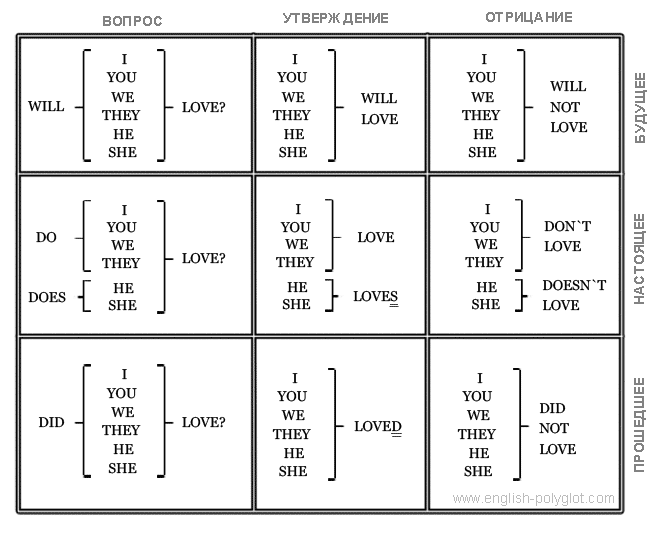
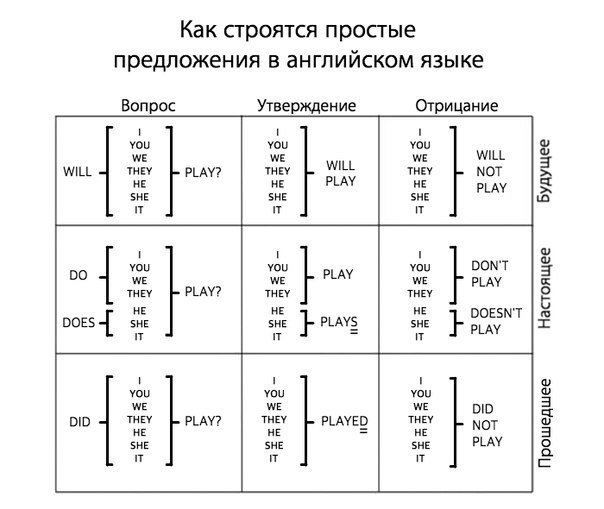
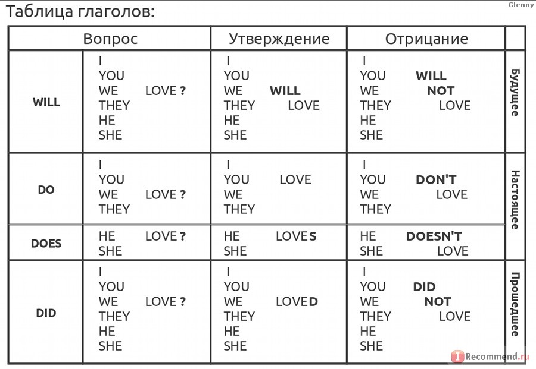

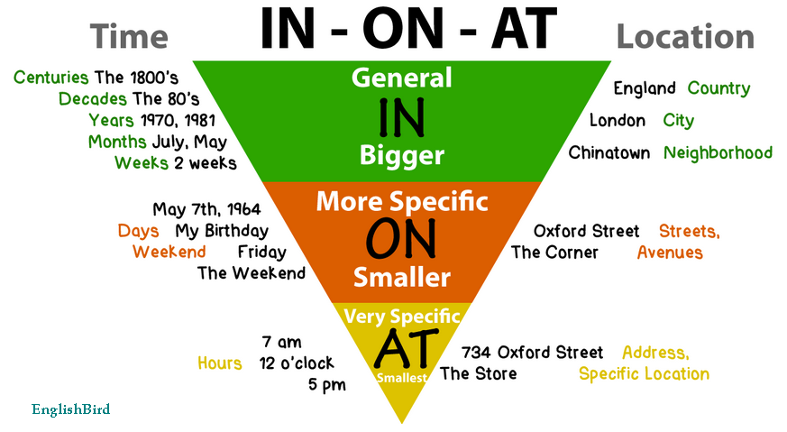

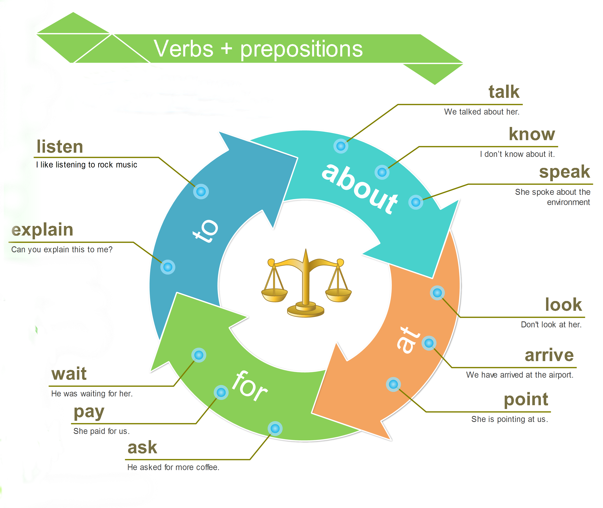
